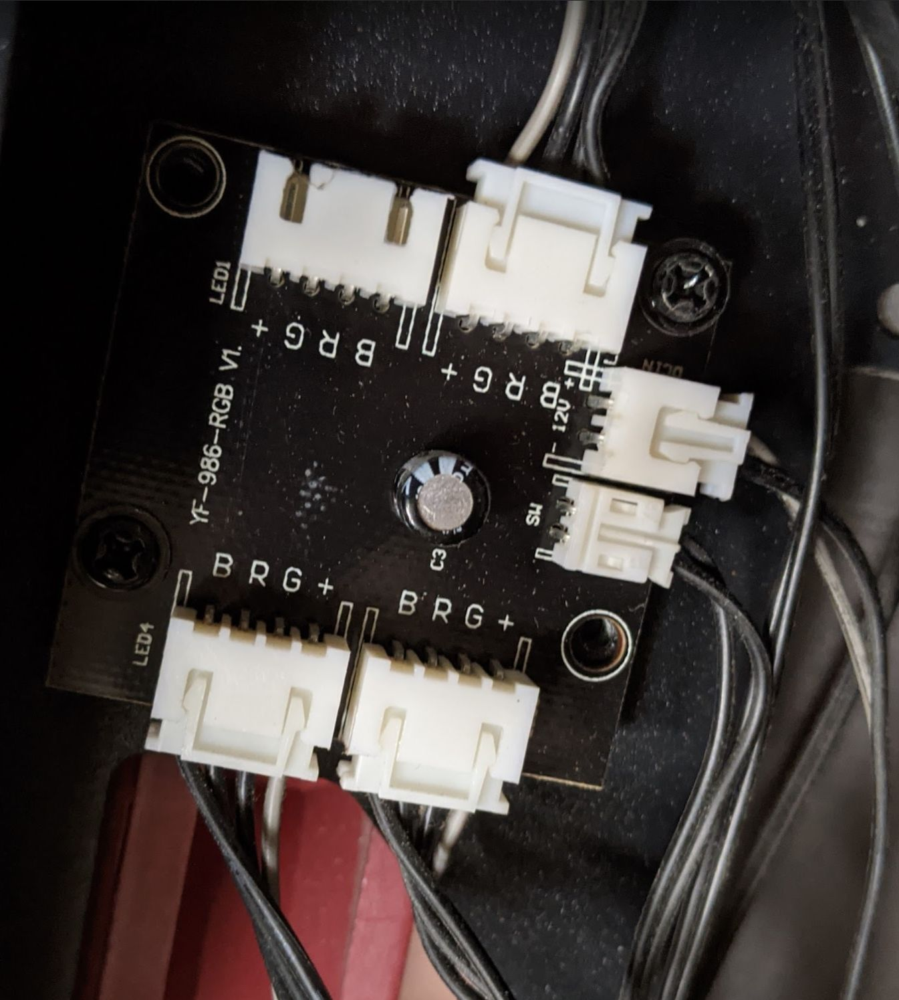
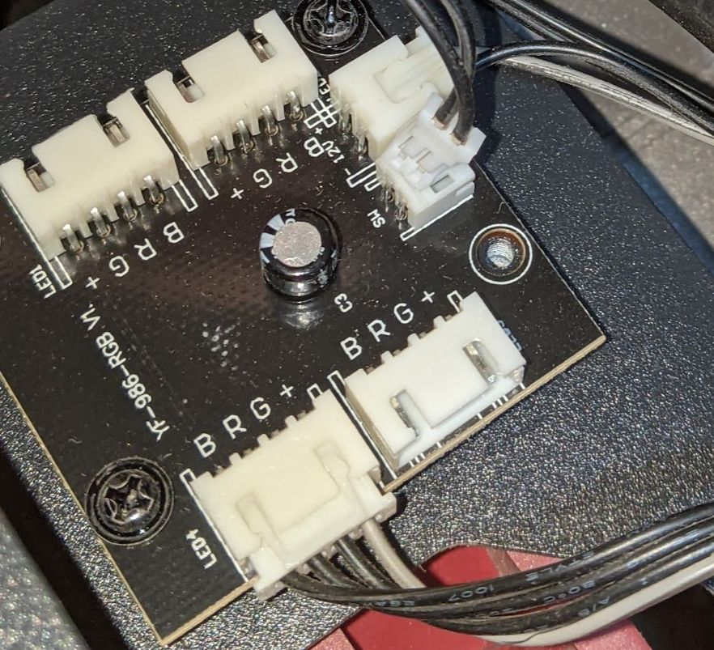
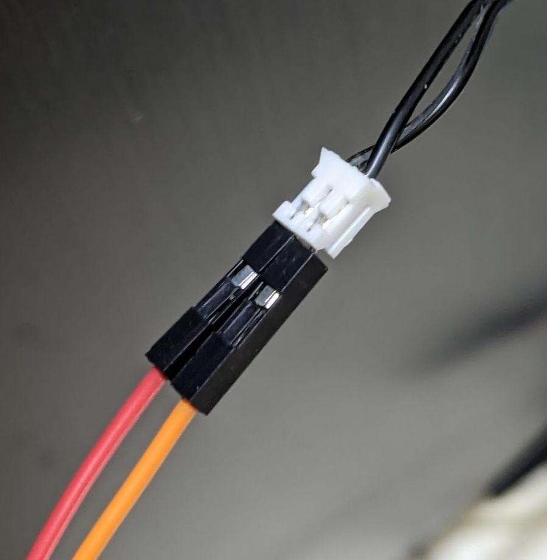
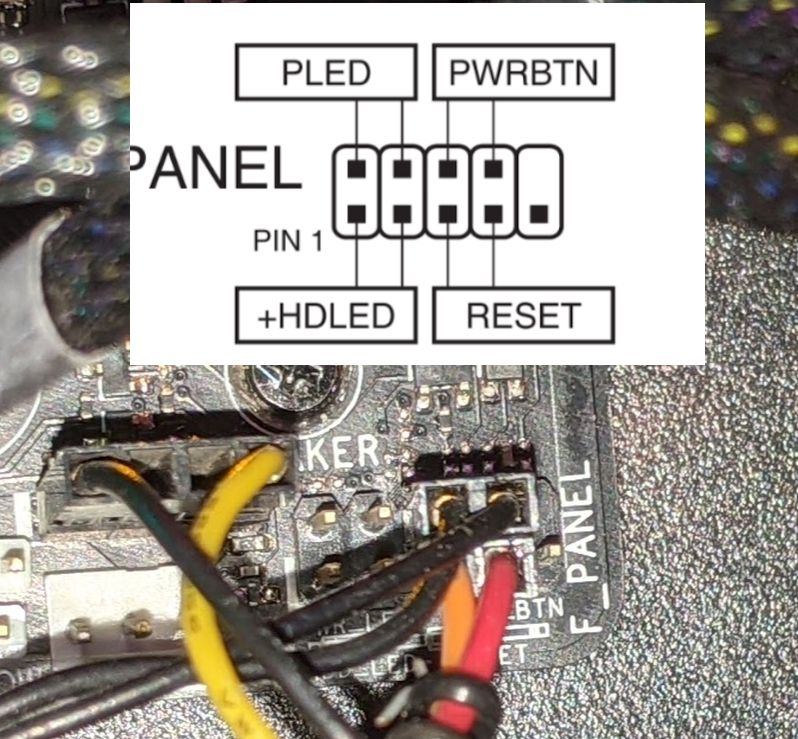
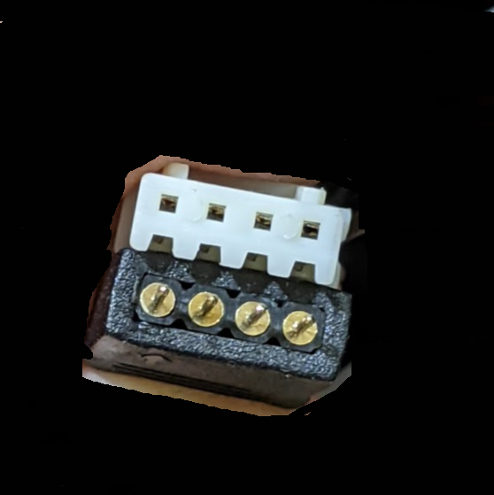
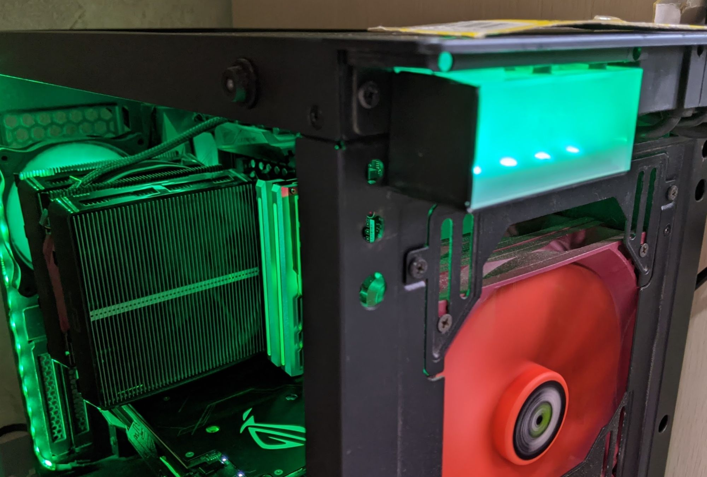
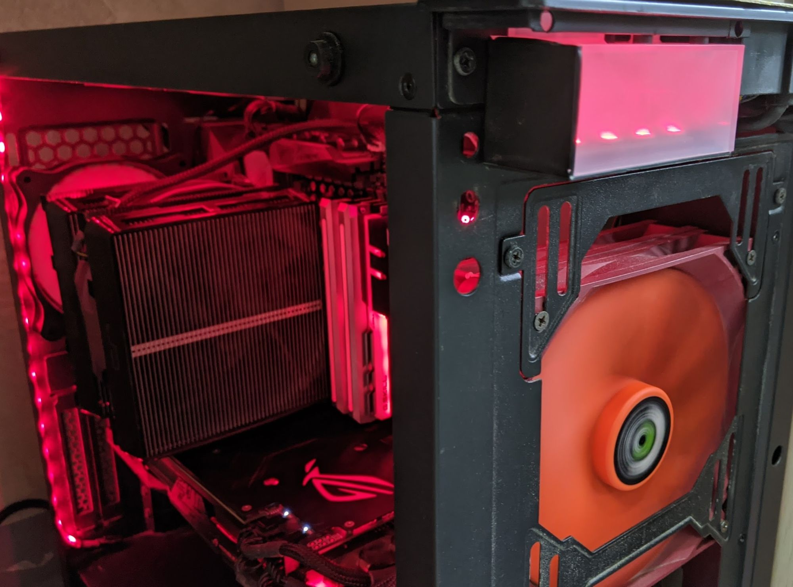

Antec P110 Luce這咖機殼大約是在2018年買的，拿時候以為只有很廢LED鍵，到了今年無聊打開研究才發現原來可以讓前面板同步RGB，回歸主機板的重啟鍵(LED鍵)，LED鍵還真的不太會誤觸不改你改誰。

LED控制器會有下面兩條4pin母公延長線，右上一條4pin前面板，3pin 電源輸入，LED按鍵的2pin。

LED按鍵的2pin 有機會可以直接到主機板上

*LED控制板*

LED按鍵的2pin，有機會可以直接到主機板上，不過要走線原本的2pin改不好接，所以多用了麵包線公頭轉母頭。

*LED按鍵的2pin有機會可以直接到主機主板*

正反好像沒差

*接上主機板RESET SW（ASUS）*

上面的4pin和RGB的4pin大小一樣

*上面的4pin和RGB的4pin大小一樣*

接上主機板灰線對12V

*接上主板*

開啟後就可以燈光同步了，幾乎零元的改裝，真棒。

