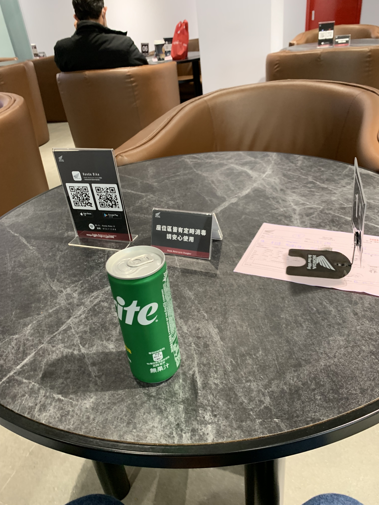
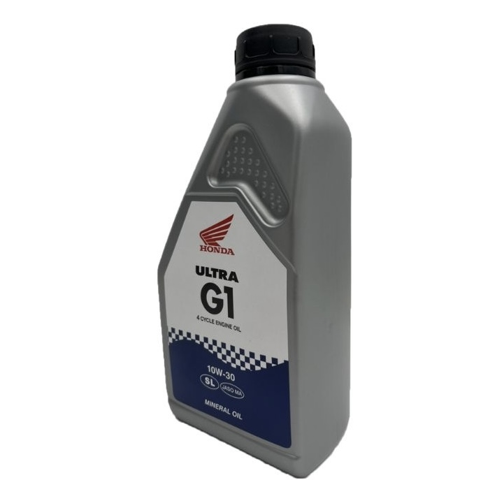
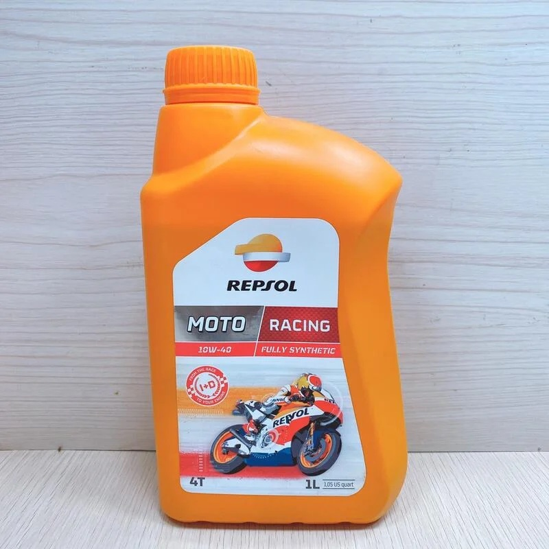
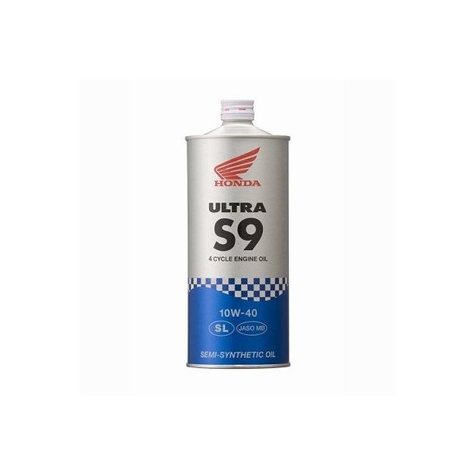
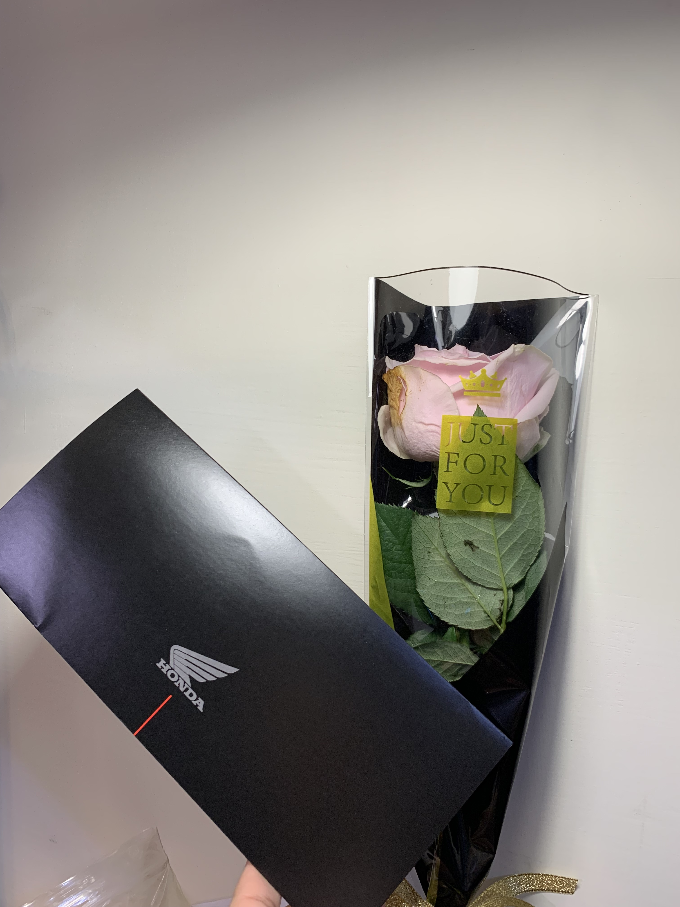
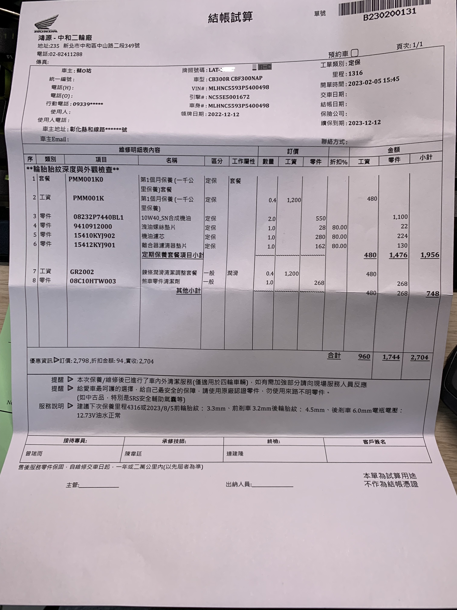

自從 2022 年末踏出夢想的第一步買了 CB300R 到現在已經過了兩個月，身為假日車到現在也終於滿了 1000 公里，終於可以花花買新車時所送的保養免工資券，體驗看看買台本車的"尊榮"待遇了，由於是在中和本田買的，所以從中部老家騎西濱上來後就直接把髒兮兮的車開去保養，來體驗看看並且發此篇開箱文

---

## 前言

首先，強烈建議大家來保養時一定要先預約，否則有人的時候保養可能會花到 1hr 以上，如果你會因為想要多吃免費冰淇淋以及喝飲料而想待久一點的話到也無妨，沙發也算好坐，但身為一個無所事事就會想睡的我來說，真的是等到快睡著。

## 保養選項

在保養選擇上分成幾個部分可以選擇，分別為機油、鏈條潤滑清潔調整套餐(前兩個皆含在免工資券裡面)、煞車零件清潔(自費)，首先機油的部分可以選的分別有(圖片僅為憑印象所找的類似圖片)

-   原廠機油  
    
-   Repsol 機油  
    
-   Honda S 系列機油 (應該是？有錯歡迎更正）  
    

由於官方人員說市區道路不建議使用圓形的那款機油 (不知道是哪一款)，所以也沒問價格，原廠機油又很普通，因此在兩款 Repsol 機油中做選擇 (10w-40 / 5w-40)，價格分別為 550元以及 650 元，由於我個人兩點長途來回比較多，因此選擇了 10w-40 (不夠客家)。

另外，免費工資方案會自動幫你"加購鏈條潤滑清潔調整套餐"，會幫你清潔鏈條到乾淨溜溜。  
官方人員還會詢問是否要加購煞車零件清潔，說是可以清除煞車粉塵，雖然個人覺得沒什麼差，但是第一次來還是覺得當個盤子加購了。

選擇完後就開始前面的無聊等待過程～

## 完工

就在我喝了兩罐飲料並準備找木棒吃冰淇淋時，工作人員默默地找了過來並輕聲的問到「先生您的車保養好了，要先來確認還是等你吃完」，尷尬的我立馬放下木棒跟著他檢查車輛狀況，大致上檢查了機油、水箱水、機油濾心、卸油螺絲墊片、鏈條、電瓶、胎壓等等，我還有順便請他調整後避震硬一些，就完成了這次的檢查。

## 保養車車也要被嘲諷？

由於前面說到我有加購煞車清潔，因此需要去結帳，結帳完後櫃台的小姐姐滿臉笑容的拿出公司準備好的情人節贈品 (時不時好像都會送贈品，之前取車時有拿到紅包袋) 說著「情人節快樂，這朵花送你」，並拿出了一朵花 (原本以為是假花，回去時猜發現是真的)，雖然內心百感交集，但表面上用了尷尬且不失禮貌的笑容回應了對方，不知道台本經銷在選擇贈品時有沒有想過某些人的情況QQ (?)，我缺的不是花，是...  

## 總結

雖然這次基本上是免費的，但也可以和大家分享一下台本保養 CB300R 的費用以及分析：  

總體來說，零件的價格其實都不算貴，主要是精美的工資定價 (1HR 算 1200，比我的時薪高了好幾倍，都想去當台本維修員了)，另外鏈條保養的部分自己來也可以省下不少。

以上就是本次的小車車紀錄文，謝謝大家收看！
