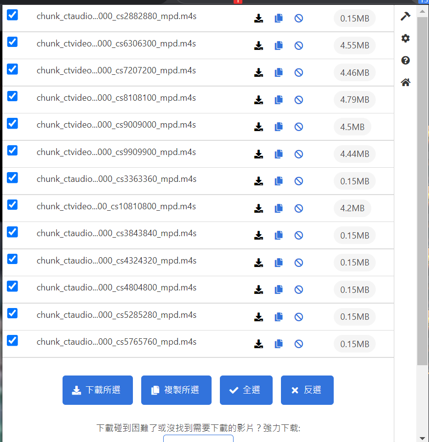
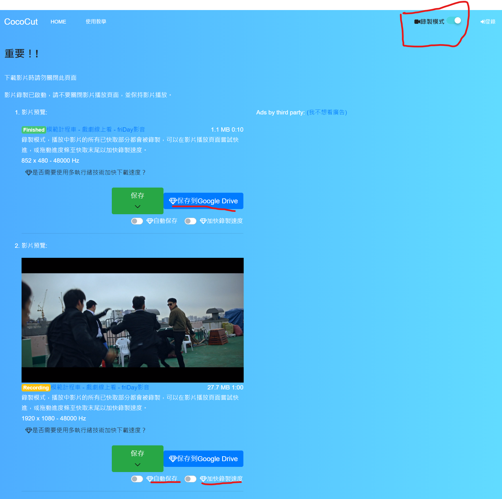
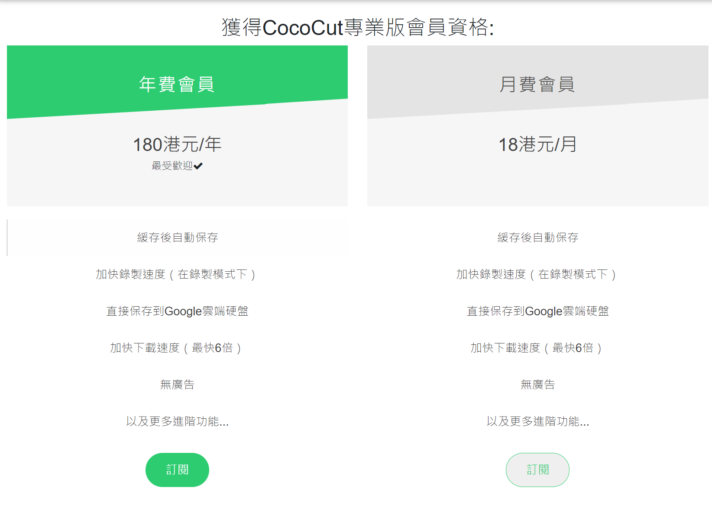

這應該是目前看過最無敵的影片下載器，老司機必備

安裝網址: [https://chrome.google.com/webstore/detail/video-downloader-cococut/gddbgllpilhpnjpkdbopahnpealaklle](https://chrome.google.com/webstore/detail/video-downloader-cococut/gddbgllpilhpnjpkdbopahnpealaklle)

介紹網址: [https://cococut.net/](https://cococut.net/)

### 為什麼會需要這款工具呢?

以前的線上影片簡單暴力，直接把影片下載下來即可，然而現今的影片網站利用串流技術，讓大家在觀看影片時可以不用因為頻寬等等問題而煩惱影片讀取的問題，但是對於想抓取影片的使用者就是一個大難題了，主要是因為以下幾個問題:

-   影片被切割成多個小檔，難以手動下載
-   平台會用多種分割技術，讓你難以撈取分割檔

直到最近看到了一款 chrome 插件，也就是 CocoCut，會自動在背景撈取影片區塊，只須在安裝後直接點擊圖示就可以看抓到目前讀取過的影片，如下圖:

不但可以抓取單檔影片，也可以將 hls 等等的串流影片抓出來，並且一次批次下載，實在方便。

另外與一般抓取工具最大的不一樣是，他具有錄製模式，尤其是上述 hls 格式或者有加密的影片，一般自己抓切割檔的話還需要透過 m3u8 等等的工具去進行合併，不過這款工具一次解決了這些問題，你只需要按下錄製模式(如下圖)

進入頁面後開啟右上角的錄製模式即可:

接下來在你播放影片時就會自動錄製影片到圖片中的預覽區塊，**所見及所得**，非常方便。

### 特殊的功能

然後你發現了嗎? 還有兩個紅線處的區塊，這就是付費才能解鎖的功能拉，其中一個是非常實用的加速功能，可以幫你節省非常多錄製影片的時間，另一個自動保存則能夠避免突然性的中斷導致資料的喪失，最後一個則是自動保存到 Google Drive 上面，雖然 Google 已經開始養套殺，但是就目前而言 Google Drive 還是非常好用的，以下這功能都包含在 Pro 會員方案中，以後還有可能繼續推出其他更好用的功能。

### 會員條件

工具開發者還是需要養家活口的，因此較為特殊的功能會以月費的方式收取，每個月的話是 18 HKD，一年份的話是 180 HKD，等於買十送二，如果是常用的使用者，我相信這會非常的划算!

