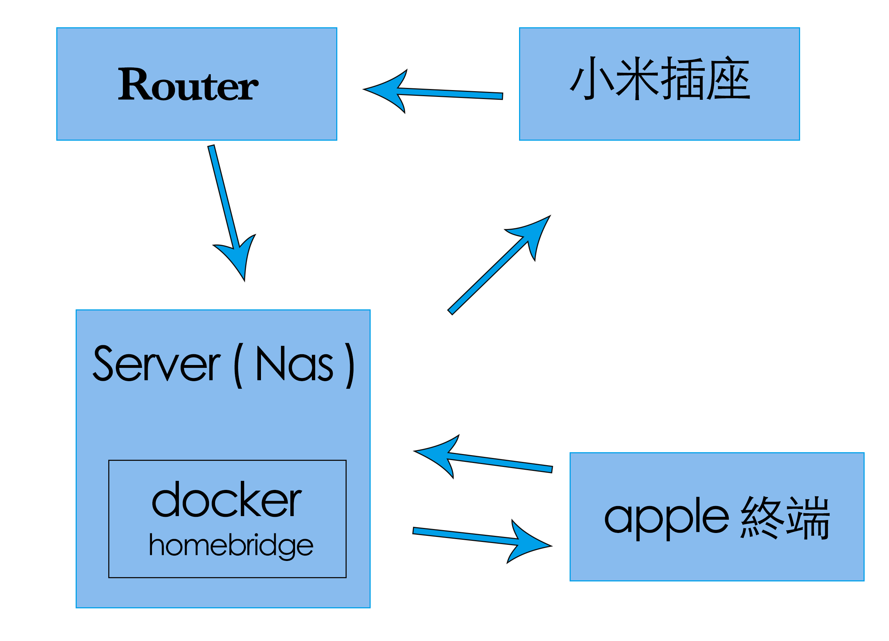
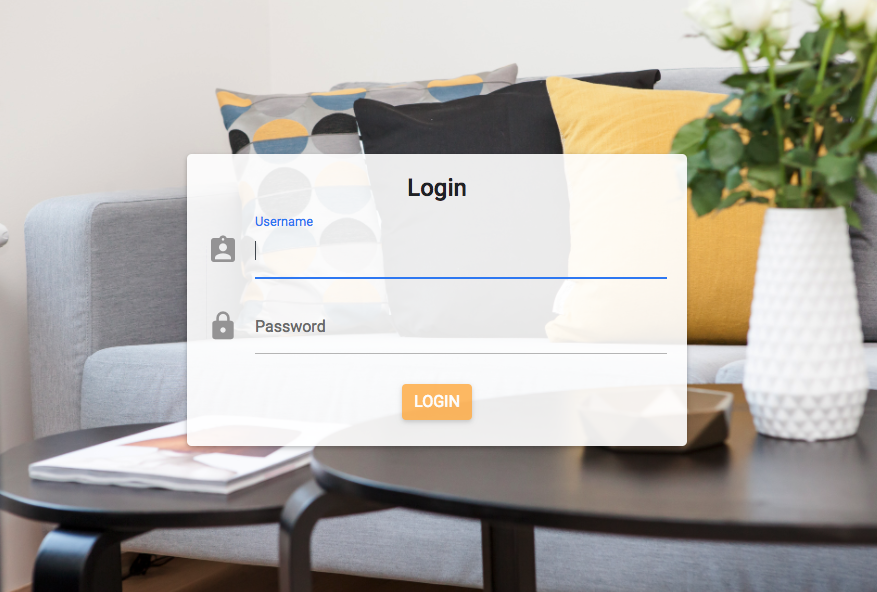
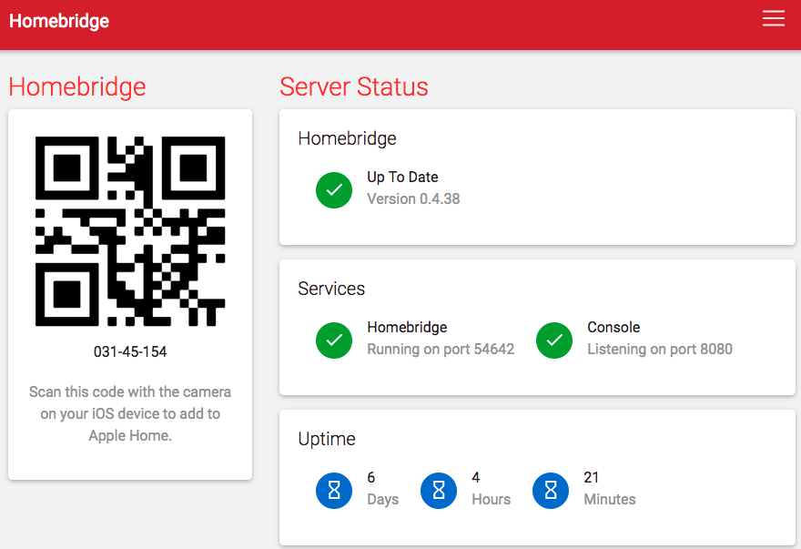

自從上篇文章到現在好像過了有點久（恩？），中間發生了不少事情，也打算寫幾篇文章，但都還沒寫 (?)。

費話不多說，難得剛好開始玩起小米的插座，並且正在研究各種玩法，玩出了點小心得，以及可能遇到的雷，這篇文章基本只有插座的簡單設定及教學，配置設定基本上也是參考別人套件以及說明文件，目前也有買了網關等等 zigBee 設備，持續研究中～～

首先先來說一下需要的環境以及硬體雷

> 小米插座目前沒有台規，然後陸規需使用三孔插座 ( 三角形那種 )，需要使用轉接頭，不過插座部分如果沒有接地頭則可以接上去 ( 需要沒有防呆不然會卡住 ) ，請先確認能接受再開始玩吧！
> 
> 此文章會使用 Docker 容器，需要一定程度認識 linux or docker（此篇無 docker 教學）

首先是控制主角：小米智能排插

再來是簡單的架構（我用nas 來承擔 Nas 的服務）

簡單的說，必須要架一個 [homebridge](https://github.com/nfarina/homebridge) （家庭橋接器） 讓不支援 apple home 的設備經由它模擬支援裝置，藉以達到查看及控制功能

## 架設

首先就先來架設 homebridge 服務吧，別人製作公開的docker image 好像是[這個](https://hub.docker.com/r/marcoraddatz/homebridge/)比較有名，但太胖我不想用那個，我使用 [oznu](https://hub.docker.com/u/oznu/)/[homebridge](https://hub.docker.com/r/oznu/homebridge/) ，配置部分就把容器的 /homebridge 掛載到你要的位置，網路改為共用 host ( 這樣才抓的到區網裝置 )，然後在 ENV 部分加上 HOMEBRIDGE\_CONFIG\_UI = 1 可以啟用 web UI

docker 指令（我用 UI 調的，有問題再跟我說）

> docker run \\
> 
> –net=host \\
> 
> –name=homebridge \\
> 
> \-e HOMEBRIDGE\_CONFIG\_UI=1 \\
> 
> \-v <你對應的資料夾位置>:/homebridge \\
> 
> oznu/homebridge

如果你是使用 Synology Nas 架的話可能會遇到 [Host name conflict](https://github.com/oznu/docker-homebridge/issues/35) 導致一直重複配置 address record 的問題，解決辦法是 ENV 上要加 DSM\_HOSTNAME=<你的nas名稱> 來解決，至於關閉 ipv6 跟打開 Bonjour 服務我不知道是不是必須，不過都弄確定一定就不會在遇到這問題了。

再來則是要在設定配置文件，由於homebridge 是由 nodejs 寫成，因此裝其他插件需要配置 package.json (複製縮排會跑掉我難過)，跑 docker 時會自動幫你裝 node module

> {
> 
> “name”: “oznthomebrdige”,
> 
> “version”: “1.0.0”,
> 
> “description”: “”,
> 
> “main”: “index.js”,
> 
> “scripts”: {
> 
> “test”: “echo \\”Error: no test specified\\” && exit 1″
> 
> },
> 
> “author”: “”,
> 
> “license”: “ISC”,
> 
> “dependencies”: {
> 
> “homebridge-dummy”: “^0.3.0”,
> 
> “homebridge-mi-aqara”: “^0.6.8”,
> 
> “homebridge-mi-outlet”: “^0.2.8”,
> 
> “i”: “^0.3.6”,
> 
> “npm”: “^5.7.1”,
> 
> “yarn”: “^1.5.1”
> 
> }
> 
> }

以及 config.json （所有連小米設備設定都是用這），目前僅先設定橋接器

> {
> 
> “bridge”: {
> 
> “name”: “HomeBridge”,
> 
> “username”: “00:11:22:33:44:55”,
> 
> “port”: 54642,
> 
> “pin”: “031-45-154”
> 
> }
> 
> }

正常情況下，現在就可以在8080 port 看到登入介面了

預設帳密都 admin，登入後因該可以看到這介面，然後就拿手機去開家庭去掃條碼吧

不過這樣還不會有設備，你還必須配置 config.json 添加相關設備對應 ip 及 token ，如果讀取有困難可以使用以下 library : [miio](https://github.com/aholstenson/miio)

具體安裝只需安裝 nodeJs 環境 並下以下指令即可

> npm -g miio
> 
> miio

直接執行後，就會列出在同網域的所有小米裝置了

接下來根據對應套件將設定配置進去

> ## 懶人包
> 
> 小米可用套件集合導覽：[網址](http://homekit.yinhh.com/)

根據裡面的 read.me 配置即可

以下是我的範例設定，可以參考看看，**以對應套件設定為準****，如果有相關問題也可以底下問我**

> {
> 
> “bridge”: {
> 
> “name”: “HomeBridge”,
> 
> “username”: “00:11:22:33:44:55”,
> 
> “port”: 54642,
> 
> “pin”: “031-45-154”
> 
> },
> 
> “platforms”: \[
> 
> {
> 
> “platform”: “MiOutletPlatform”,
> 
> “deviceCfgs”: \[
> 
> {
> 
> “type”: “MiIntelligencePinboard”,
> 
> “ip”: “192.168.1.150”,
> 
> “token”: “94a524dd1b62bcbf3716c3009e53ae11”,
> 
> “outletName”: “master room outlet”,
> 
> “outletDisable”: false,
> 
> “temperatureName”: “master room outlet temperature”,
> 
> “temperatureDisable”: false,
> 
> “switchLEDName”: “master room led light switch”,
> 
> “switchLEDDisable”: false
> 
> }
> 
> \]
> 
> },
> 
> {
> 
> “platform”: “MiAqaraPlatform”,
> 
> “gateways”: {
> 
> “7811dce16962”: “44303D001F714B8E”
> 
> }
> 
> },
> 
> {
> 
> “platform”: “config”,
> 
> “name”: “Config”,
> 
> “port”: 8080,
> 
> “sudo”: false
> 
> }
> 
> \],
> 
> “accessories”: \[
> 
> \]
> 
> }

設定完成之後因該就可以直接在 iOS 家庭 APP 控制對應的設備了，而這篇教學文就到此結束拉～～
