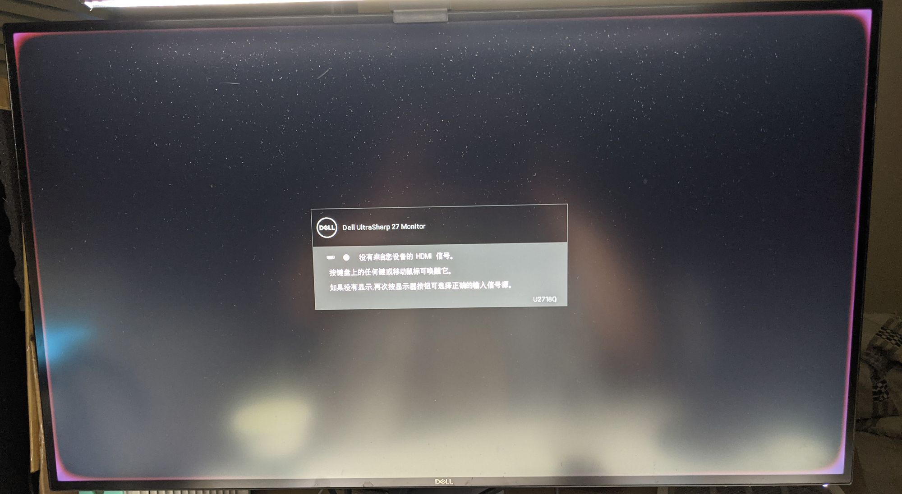
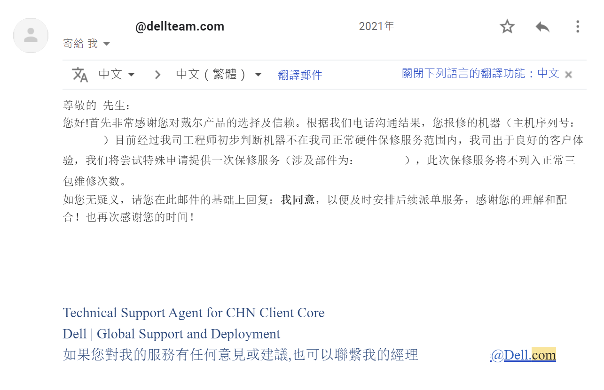
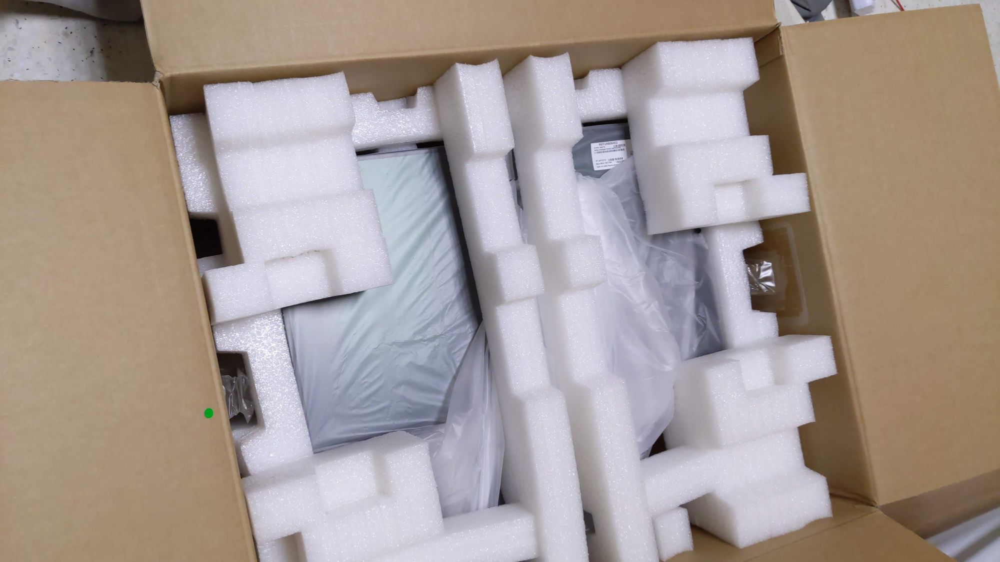
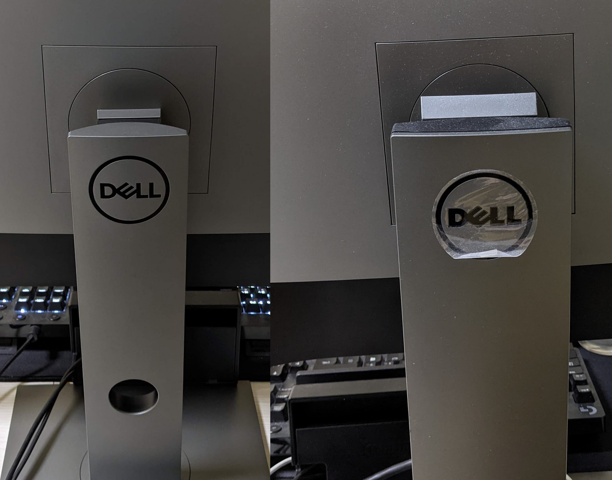

*邊角發紅*

在2020年七八月左右我購買了，  
亞美amazon的Dell U2718Q 但在今年三月多的時候發現長時間使用後，  
發生這情況至少使用一小時以上才會發生，  
開始邊框發紅的情況，也中了通病問題，  
就只能趁就和Dell客服詢問了。

經過和中國Dell的客服確定，保固轉移功能是特定系列轉移才有效果的，  
最為重要的是"基本保固"，不再享有國際保固服務，  
但只要加購premium就有國際保固服務了，  
amazon上的一定是沒有加購premium服務的，  
根據網路上說法是可以自己去找Dell業務加保Premium或ProSupport，  
據說會根據保固長短會有不同的加保價格，  
而如果只有基本保固是沒有人權的，  
因為你沒有付錢Premium支援，  
基本上你只能用email和客服反應，  
電話也只能一到五上班日九點到十八點可以打電話，  
基本上email比較快，打電話進去要轉接超久的，  
而其次是語言上的障礙一大問題，  
一樣是中文但就是用詞和口音會聽不懂。

請注意：自 2017 年 3 月 13 日起，Alienware、Inspiron、G 系列及 XPS 系統 (包含周邊設備與顯示器)，出貨時即具有基本保固的客戶，如前往或搬遷至原購買國家/地區以外的地方，將不再享有國際保固服務。此政策不適用於前往或搬遷至巴西或阿根廷的客戶，或其他無販售此服務權益之國家/地區。在巴西境外購買的產品自發票開立之日起，享有 90 天的法定保固。

Dell 國際支援 說明連結

就還是選擇了一次性更換了，  
但是當初因該說原本外箱不見了，  
因為如果你說原廠箱子還在叫你使用原廠箱子，  
但是寄給你的外箱卻不是一般的彩盒，  
而是特殊防護大紙箱....，  
但是實在是太太大大大的。

*實在是太太 大↘ 大↘ 大↘*

至於U2718Q和U2720Q差別在哪裡，  
螢幕支架變細了，  
有沒有差異有因為重量變輕了，  
導自轉左右方向U2720Q底座也會跟著轉。

*U2720Q和U2718Q支架*

<table><tbody><tr><th></th><td>U2718Q</td><td>U2720Q</td></tr><tr><td>USB port</td><td>USB type A (背後+側面) * 2、USB type B * 1</td><td>USB type A (背後+側面) * 1、USB type C (背後+側面) * 1</td></tr><tr><td>USB HUB 上行</td><td>USB type B</td><td>USB type C(螢幕顯示的那個)</td></tr><tr><td>輸出介面</td><td>HDMI、DP、mini DP</td><td>HDMI、DP、type C</td></tr><tr><td></td><td>只有HDMI有HDR功能</td><td>都有</td></tr><tr><td>螢幕按鈕</td><td>一般正常按鈕</td><td>垃圾難按(不突出按鈕小、觸發力度大)</td></tr><tr><td>面板顏色</td><td>紅色</td><td>綠色</td></tr><tr><td>面板推測</td><td>LG LM270WR5-SSF1</td><td>? AUO M270QAN05.0</td></tr><tr><td>被蓋做工</td><td>沒印象</td><td>爛，邊角沒扣緊，壓也無解</td></tr><tr><td>整體動態亮度</td><td>有</td><td>好像沒有</td></tr><tr><td>背光PWM</td><td>650Hz</td><td>無閃爍</td></tr><tr><td></td><td colspan="2">PWM資料來自<a src="https://www.rtings.com/monitor/reviews/dell/u2718q">rtings</a></td></tr></tbody></table>

結論

只少在保固內成功送修成功吧，U2720Q就真的很嚴重cost down了，  
有改進U2718Q但是價格還是貴，反而S2721QS可能有比較好的CP值。

優點  
\* IPS、4K  
\* 易於調整的支架，符合人體工程學  
\* 付錢有保固  
\* Type C  
\* HDR400 支持

缺點  
\* HDR 普通  
\* 60hz 刷新率  
\* 沒有動態更新率  
\* cost down 做工不好  
\* 貴
