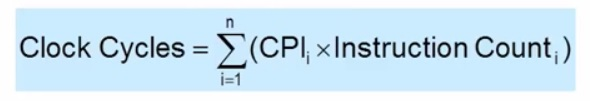

\[vc\_row\]\[vc\_column\]\[vc\_text\_separator title=”Chapter1″\]\[vc\_column\_text\]相對效能 : (效能A\\執行時間A) / (效能B\\執行時間B)  
Response time 一份工作從開始到結束的完整時間  
Throughput Response time中的總工作量  
instruction no. ：指令個數。  
Instruction Set指令集特性 …… RISC vs. SISC  
CPI ：clocks per instruction (每個指令所需的週期數)  
clock cycle time：每個週期所需的時間  
clock rate ：clock cycle time的倒數  
CPU excecution time=Instruection count*CPI*Clock cycle time

CPU excecution time=Instruection count\*CPI/Clock rate

平行計算 – 將工作切分處裡 (降低Response time)\[/vc\_column\_text\]\[/vc\_column\]\[/vc\_row\]\[vc\_row\]\[vc\_column\]\[vc\_column\_text\]\*\*執行效能計算\*\*

-   CPU執行時間 = CPU clock週期 \* clock週期時間
-   CPU執行時間 = 程式執行週期 / 時脈
-   CPU執行時間 = CPI \* instructions 數量 / 時脈

CPU clock cycle = 程式的instructions \* 每個instruction平均clock週期

平均clock週期

\[/vc\_column\_text\]\[/vc\_column\]\[/vc\_row\]\[vc\_row\]\[vc\_column\]\[vc\_column\_text\]

<table style="height: 115px;" width="548"><tbody><tr style="height: 24px;"><td style="width: 266px; height: 24px;">效能組件</td><td style="width: 266px; height: 24px;">單位</td></tr><tr style="height: 24px;"><td style="width: 266px; height: 24px;">CPU 執行時間</td><td style="width: 266px; height: 24px;">秒/單位程式</td></tr><tr style="height: 24px;"><td style="width: 266px; height: 24px;">CPI</td><td style="width: 266px; height: 24px;">指令平均clock週期</td></tr><tr style="height: 24px;"><td style="width: 266px; height: 24px;">Clock 週期時間</td><td style="width: 266px; height: 24px;">秒/單位clock週期</td></tr></tbody></table>

\[/vc\_column\_text\]\[/vc\_column\]\[/vc\_row\]\[vc\_row\]\[vc\_column\]\[vc\_column\_text\]\*\*引響效能原因\*\*

Instruction Set 指令及

Organization 處理器本身的架構

Technology\[/vc\_column\_text\]\[/vc\_column\]\[/vc\_row\]\[vc\_row\]\[vc\_column\]\[vc\_column\_text\]

### 阿姆達爾定律 Amdahl’s law

平行運算後之效能提升的最大效能有限

因為有無法改進的部分

結果 -> 實質提升效率降低\[/vc\_column\_text\]\[/vc\_column\]\[/vc\_row\]
