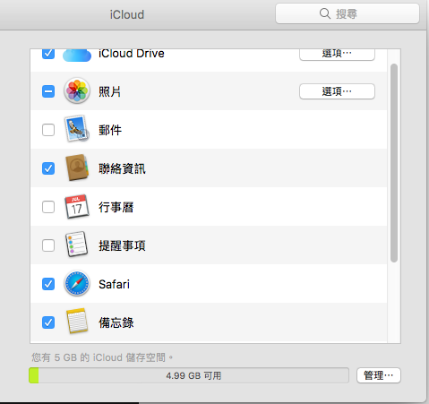

在更新到 10.12.4 之後行事曆就殘廢了 直接卡死在正在搬移行事曆至伺服器帳號，要強關才關得掉，本來也沒什麼用就放生他了，不過由於偶爾需要看下行事曆，還是來解決一下好了。

經過親自實驗 看來是頗有用的，而且看起來是 icloud 的問題

## 解決辦法

1.  先強關你的行事曆
2.  進去你的系統設定 > Icloud 面板 > 取消您的行事曆與提醒事項

> 

3.  打開你的行事曆，因為沒有同步到 Icloud 的關係，因該可以正常開啟了。如果你不想要同步到 Icloud 的話，基本上到這裡就完成了( ?
4.  打開帳號面板，重新加入你的 Icloud 帳號

> 

5.  重新打開行事曆，他會花一下子的時間同步一下資訊，因該不會太久
6.  **大功告成**

參考： [連結](https://discussions.apple.com/message/23477071#23477071) ( 參考 melisolaris 發言 )
