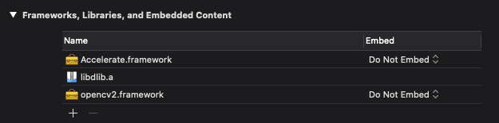
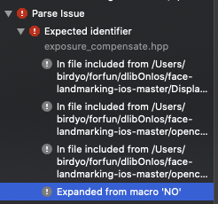
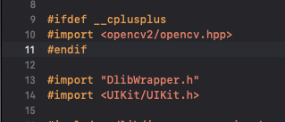

匯入的部分非常簡單只要確認 Framework 檔案有導入，專案設定確認有導入就可以直接用了  
  
(最下面的 opencv2.framework 那項)

接下來就橋接到你的 object c 檔案吧 (要接到 Swift 還要再接一層 Bridge 有空再講)  
但是邊譯時就遇到這錯誤了  

`Expanded from macro 'NO'`

後來才發現是內建的 macro check 所導致的，最簡單的解法就是放在引入其他東西之前，像是下面這樣  

這樣就可以順利編過囉
