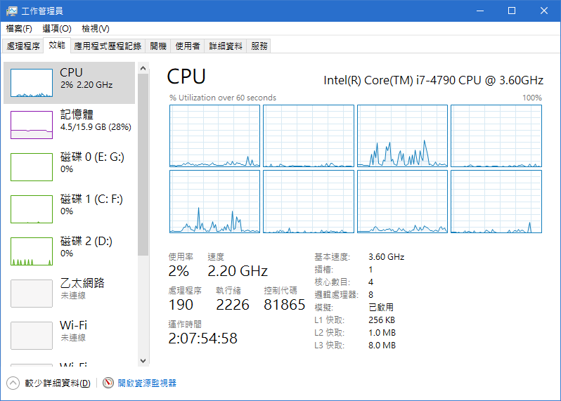
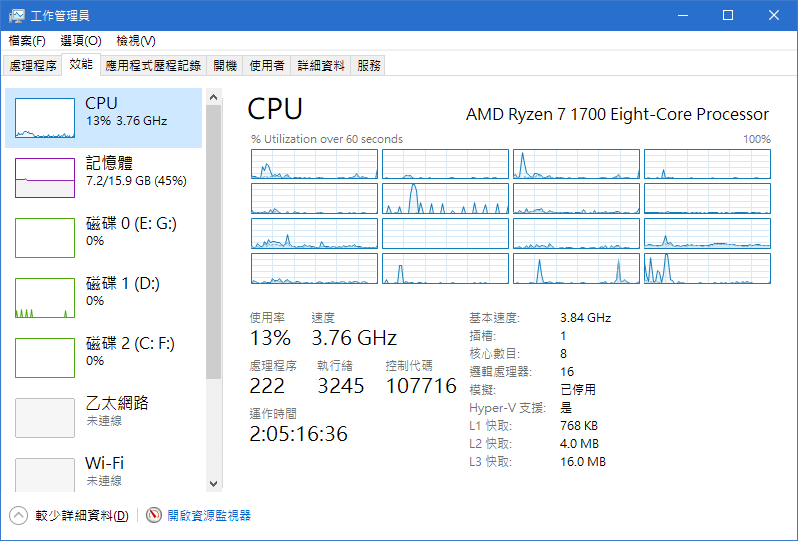
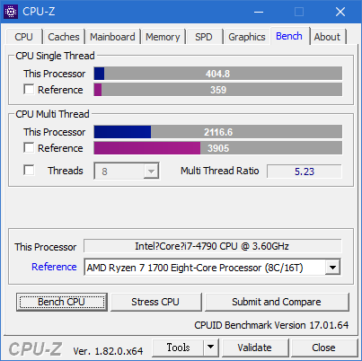
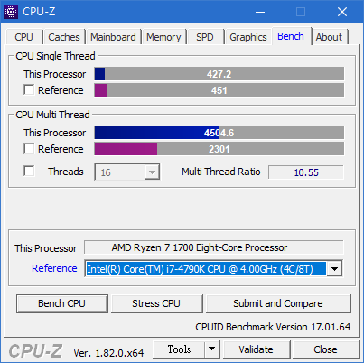
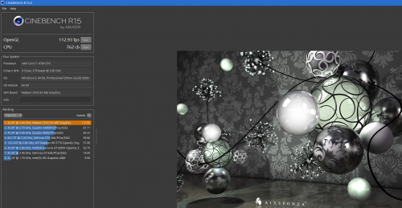
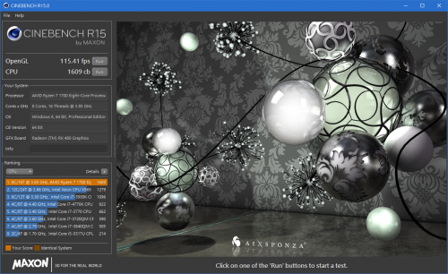
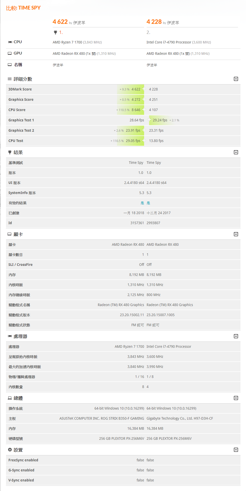
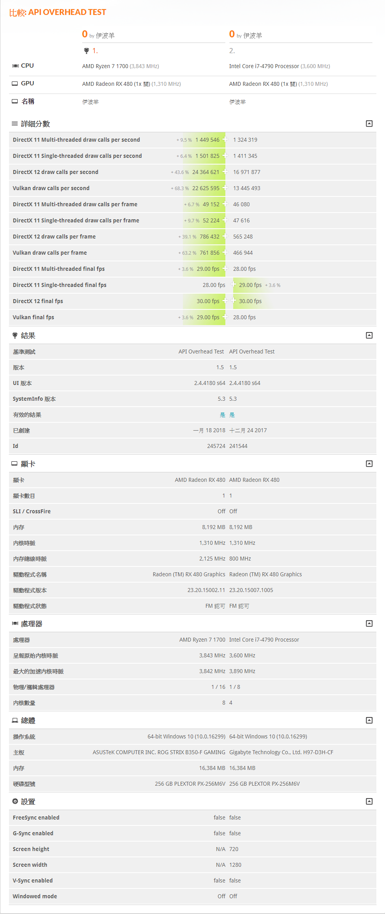
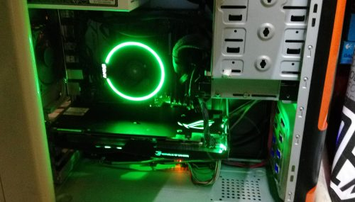

久違的無聊開箱要回來了，恩~懶\_(:3 」∠ )\_

Intel Core 4790基本上是3.6Ghz而turbo基本上好像只能到全核心3.82Ghz

單核最大4.0Ghz，恩~沒截圖到

AMD Ryzen 1700 超到3.84Ghz來比較

---

CPU-Z 的分數

 Intel i7-4790  AMD R7-1700 恩，分數以單核來十分的接近

不如說是一樣的，但核多核就因該核心的差就既有差了

---

Cinebench r15

 Intel i7-4790  AMD R7-1700 圖片沒截好

Cinebench r15Intel i7-4790AMD R7-1700OpenGL112.93 fps115.41 fpsCPU762 cb1609 cb看來分數有跟CPU-Z差不多

---

最後就是3Dmark

先申明顯卡驅動版本不同，可能造成分數誤差

顯卡時脈可能有誤判，記得我都是調到2125Mhz

就直接上圖了

---

**結論**

以單核來講是沒差的，但是1700八核心用工作管理員就是爽，

玩遊戲除了使用率的差距是沒啥感覺的，

不過原廠風扇是壓不太住1700的，

全力附載3.8Ghz溫度是會到75度的

 上機照

和為了顯卡而被打穿得硬碟架區
