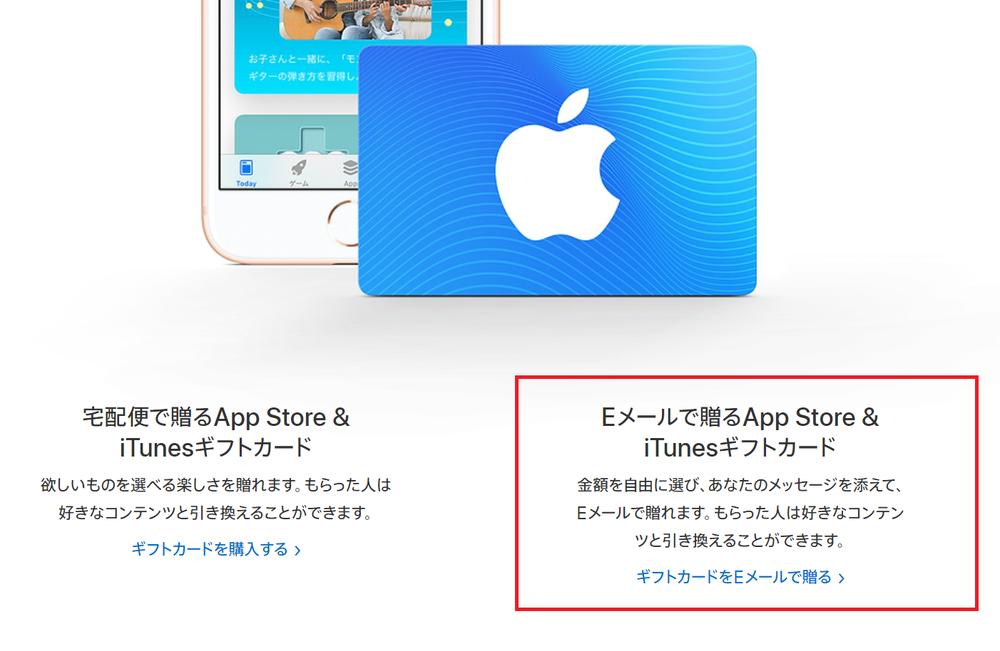
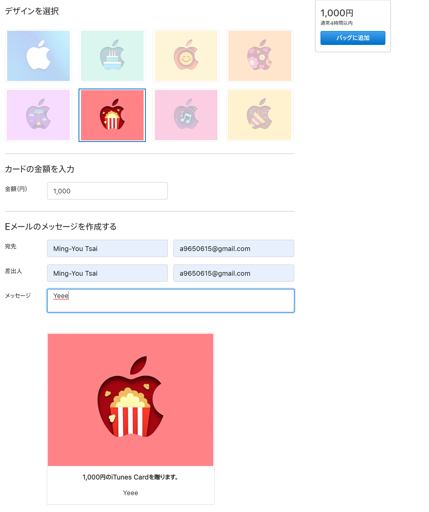
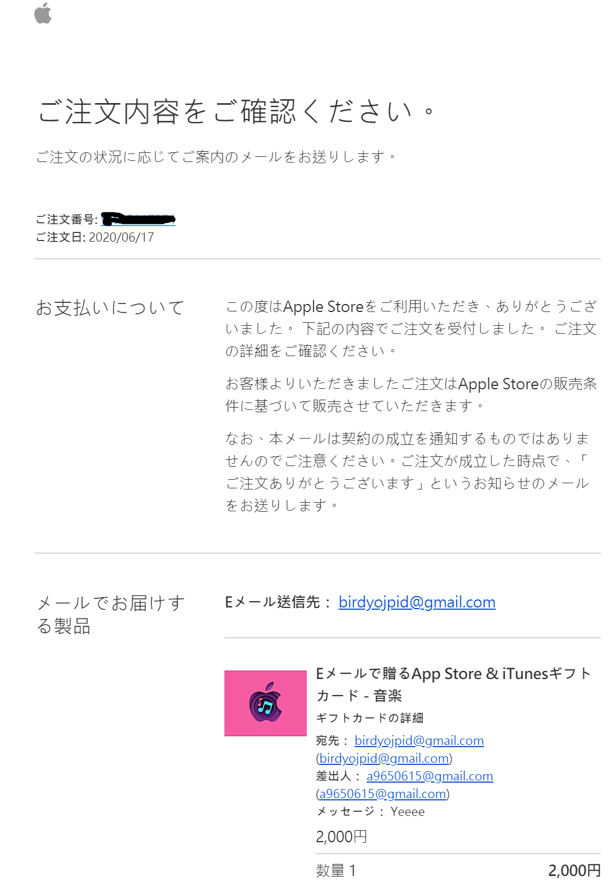
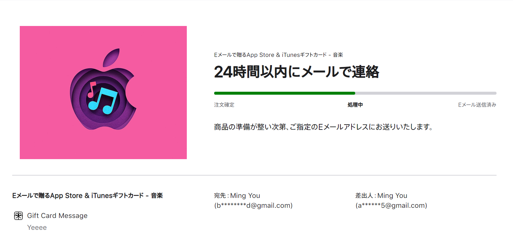
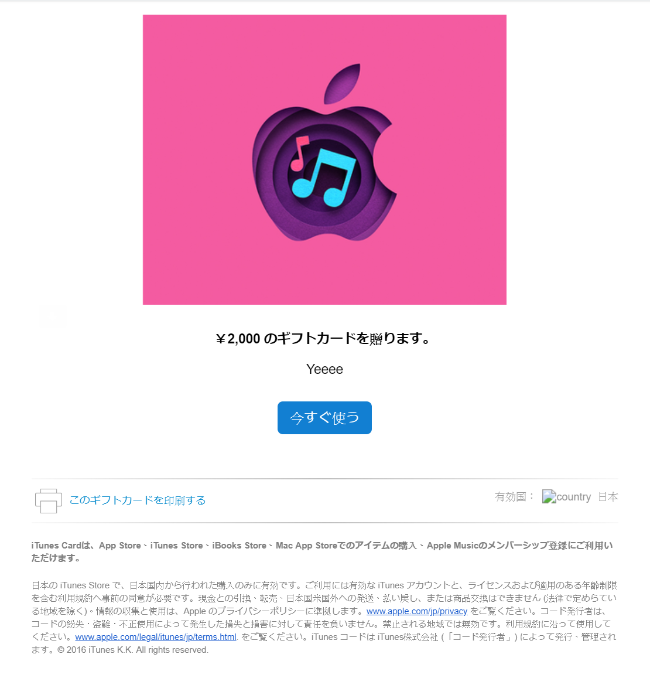
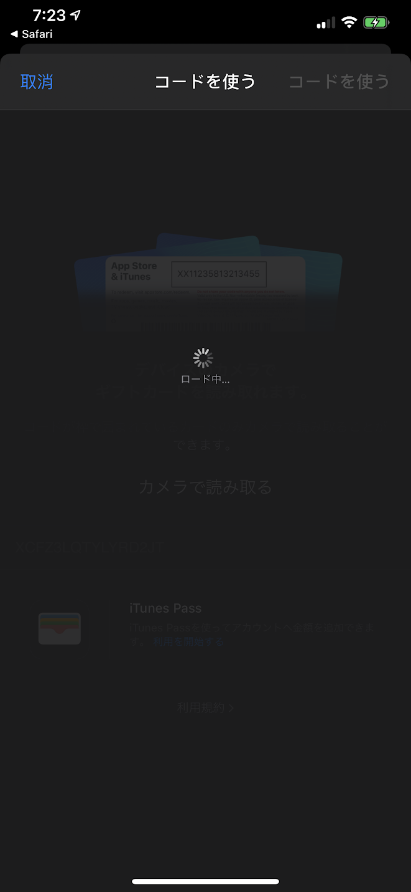
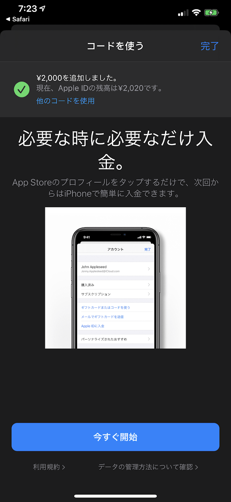

由於日區 Apple Store 並不能使用國內的 MasterCard 以及 Visa 卡進行付款，只能用 JCB 卡或者當地的付款方式，不過倒是有其他方式可以購買，就是利用禮物卡 ( Gift Card )。

---

## 必需品

-   首先必須要有可以刷的卡
-   Email
-   Apple Store 日帳

---

## 第一步 - 購買禮物卡

首先到官方[購買網站](https://www.apple.com/jp/shop/gift-cards)點擊 Email 贈送禮物卡  

登入帳號之後 ( 不一定要用日帳 )  
選擇好寄送人的 Email 名稱 (全部都填自己就可以，可以都一樣)，自已的名稱及 Email

以下為範例  
  
填好後點擊右上角按鈕即可

接下來就可以收信了，點擊注文番號可以查詢現在的狀態  
  

大概十分鐘之內會進行扣款及禮物卡寄送，在狀態寫完成寄送後大概一樣是十分鐘內就會寄到你所選的信箱了  
  
點擊按鈕後就會跳轉至 iTunes 進行兌換

 
