遲來電源供應器外表開箱遲了，一個月吧

打開了新世界的門，要不要入教阿?

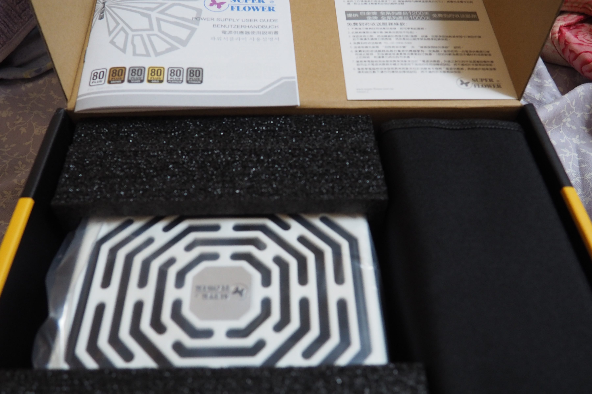開箱圖 一個主體，說明書和保證書，模組線盒嗯? 早期好像有網格布袋，少了一個信仰袋子了

(這因該是2017年4月生產吧)

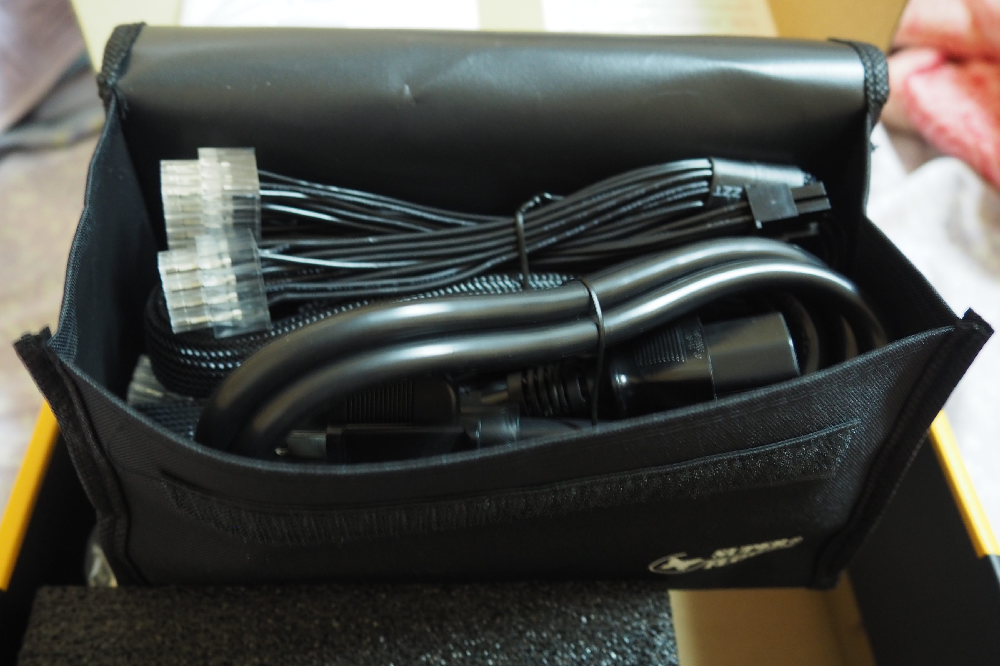

線材收納袋意外質感不錯

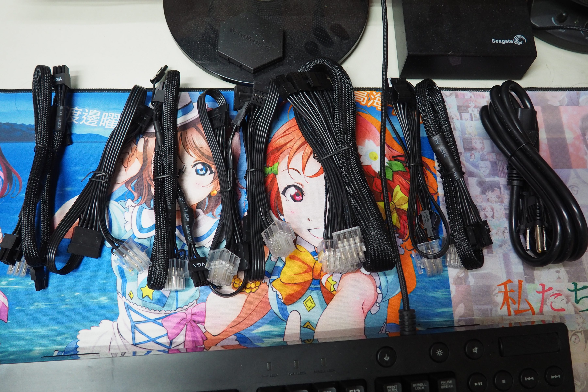線材排排站MB線24pin，MB線8pin，VGA 8pin\*2，SATA *2，大4ping*2，電源線(沒認真算過)

[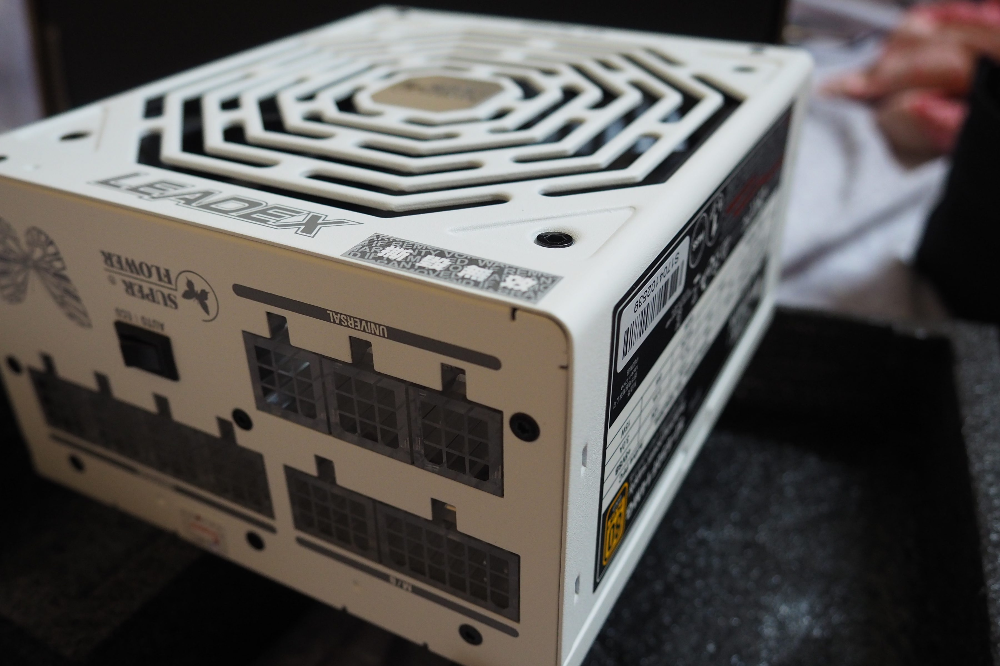](https://bgpsekai.thisistap.com/%e6%95%97%e5%ae%b6%e6%97%a5%e8%a8%98/2017/07/leadex-650w-%e5%a4%96%e8%a1%a8%e9%96%8b%e7%ae%b1/attachment/olympus-digital-camera-19/) 輸出面 [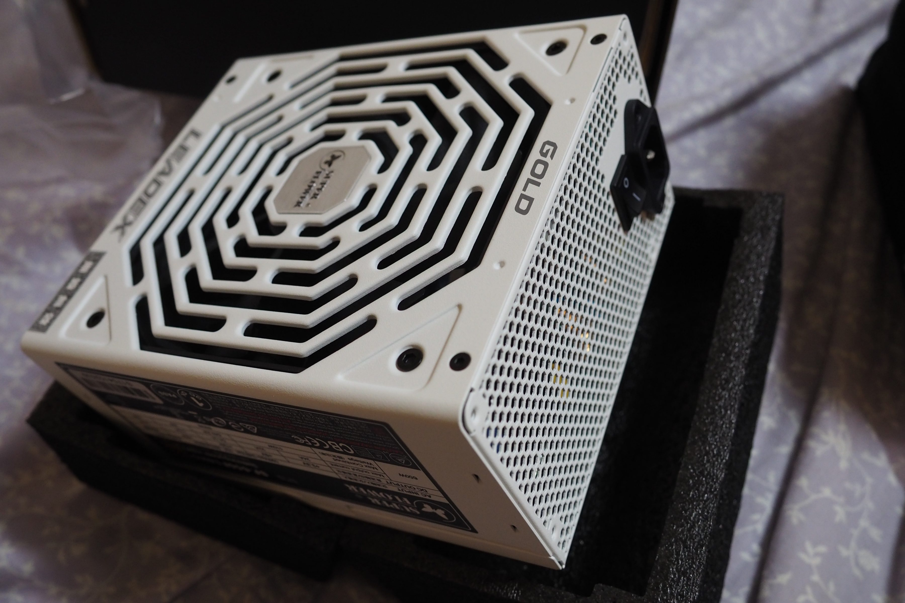](https://bgpsekai.thisistap.com/%e6%95%97%e5%ae%b6%e6%97%a5%e8%a8%98/2017/07/leadex-650w-%e5%a4%96%e8%a1%a8%e9%96%8b%e7%ae%b1/attachment/olympus-digital-camera-18/) 風扇 [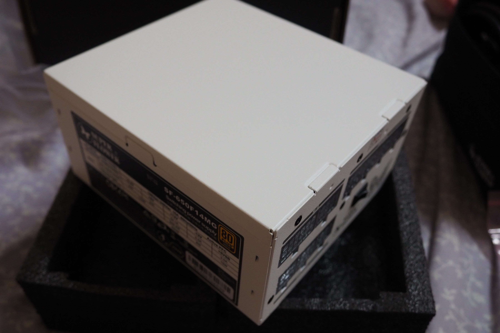](https://bgpsekai.thisistap.com/%e6%95%97%e5%ae%b6%e6%97%a5%e8%a8%98/2017/07/leadex-650w-%e5%a4%96%e8%a1%a8%e9%96%8b%e7%ae%b1/attachment/olympus-digital-camera-17/) 背板 外觀照

[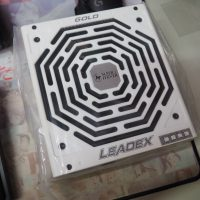](https://bgpsekai.thisistap.com/%e6%95%97%e5%ae%b6%e6%97%a5%e8%a8%98/2017/07/leadex-650w-%e5%a4%96%e8%a1%a8%e9%96%8b%e7%ae%b1/attachment/olympus-digital-camera-9/) 風扇 [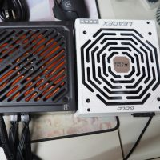](https://bgpsekai.thisistap.com/%e6%95%97%e5%ae%b6%e6%97%a5%e8%a8%98/2017/07/leadex-650w-%e5%a4%96%e8%a1%a8%e9%96%8b%e7%ae%b1/attachment/olympus-digital-camera-10/) 跟原本比對 [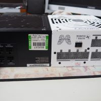](https://bgpsekai.thisistap.com/%e6%95%97%e5%ae%b6%e6%97%a5%e8%a8%98/2017/07/leadex-650w-%e5%a4%96%e8%a1%a8%e9%96%8b%e7%ae%b1/attachment/olympus-digital-camera-11/) 半模組與全模組 風扇像是有白色的，但我的是黑的雖然沒差

長度也大出新境界了

[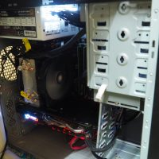](https://bgpsekai.thisistap.com/%e6%95%97%e5%ae%b6%e6%97%a5%e8%a8%98/2017/07/leadex-650w-%e5%a4%96%e8%a1%a8%e9%96%8b%e7%ae%b1/attachment/olympus-digital-camera-13/) 上機照 [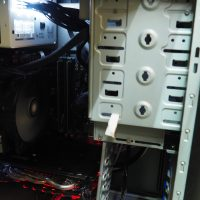](https://bgpsekai.thisistap.com/%e6%95%97%e5%ae%b6%e6%97%a5%e8%a8%98/2017/07/leadex-650w-%e5%a4%96%e8%a1%a8%e9%96%8b%e7%ae%b1/attachment/olympus-digital-camera-12/) 上機照1  
裝上去了，閃閃發光線材裝上去手感是不錯啦，還會像網路線一樣的 咖~ ，但是拔起來是來真是有夠難拔的

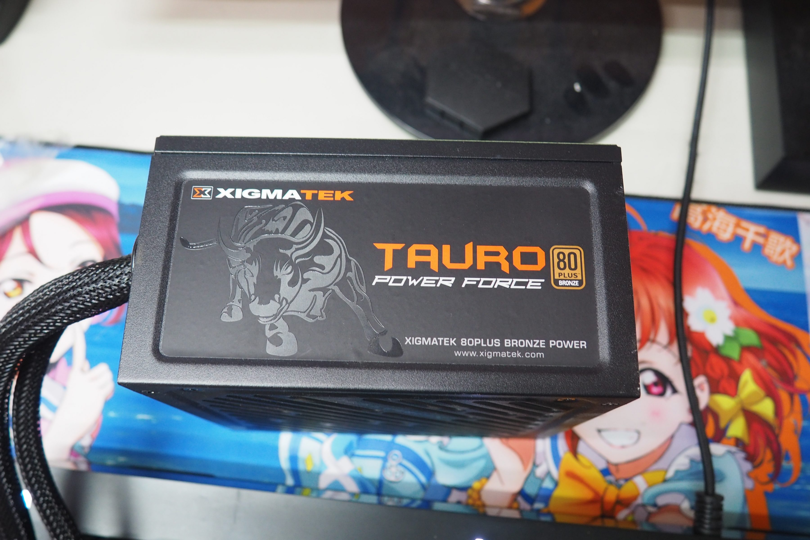給個退役特寫照

---

自於為甚麼沒壞就換新的? 因為就是想買新的

以前機殼直放沒開側蓋，去摸電源供應器風扇排氣口就會噴熱氣

但後來發現是根本是RX488在噴熱的關西

和早期機殼設計真的沒很好 熱都帶不走

上方一整個大卡熱，害我以為是金牛座在噴熱就把他換了

而金牛座在大量卡熱風扇轉速會飆上去估計在2500轉吧

反正很吵 在一氣之下就手滑了 LEADEX

而 LEADEX (auto)在卡熱狀態下，估計在1500轉，聲音小很多

雖然後就用其他想辦法排熱了，LEADEX 不一定準(印象中)

而其中一部分原因是，我這張RX488，真是有夠吃電

BIOS中 TDP(Max) 180w， madVR之類功耗到瞬間210w，也有可能(沒超頻，只是解開功耗限制)

AMD 說好的 150w 呢?  害我以為金牛座500w是超載過熱

其中是一部份，考慮自己換換病想換VEGA，聽說功耗很高

---

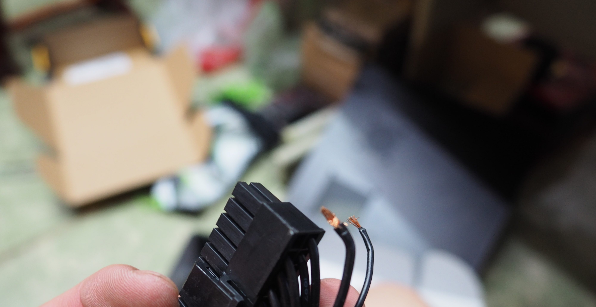手殘了還有拔線請小心，斷了這兩個價格有夠貴

明明是保內人損，換條線要500元+上兩個星期送修日

不然就是考慮模組化線也不用那貴

而修只是為了，當備援用，不然又有意外
