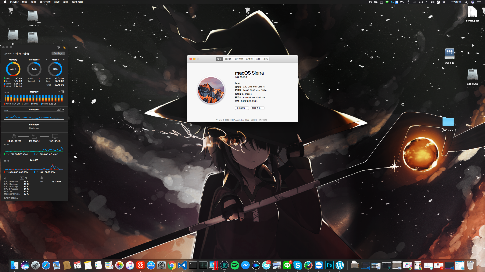
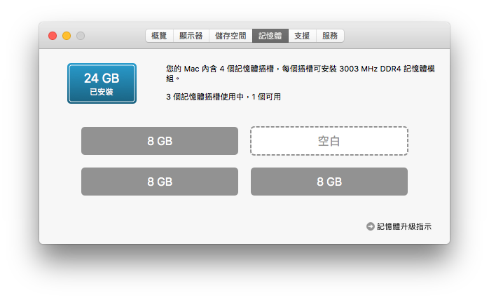
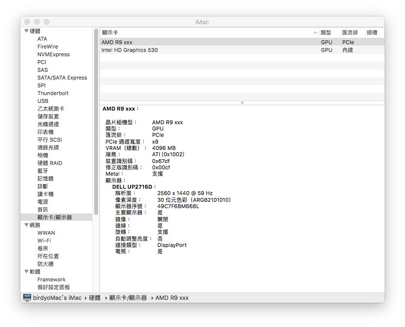
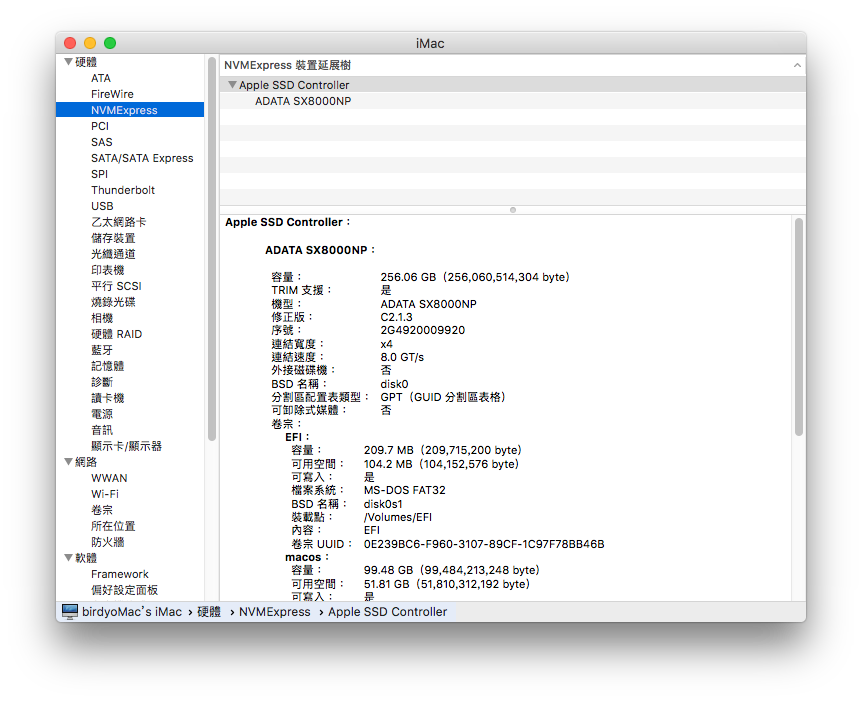
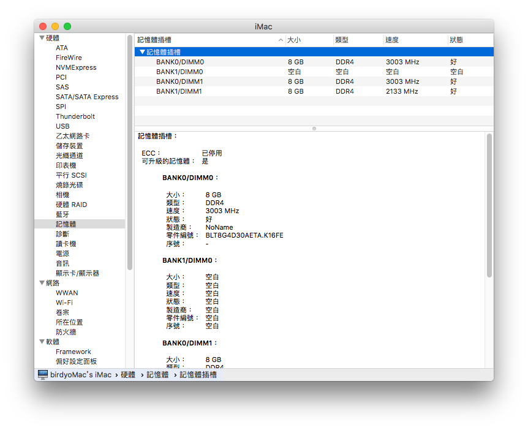

黑頻果真的是一個不容易又折騰的坑啊，以前也試過不少次，但自己功力不足，最後都失敗而歸，直到這次才有穩定到可以用的程度。

先說說硬體

CPU: i5 – 6500

RAM: 美光戰鬥版 DDR4 3000 8G*2 + 原生美光 DDR4 2133 8G*1

MB: GA-Z170MX-Gaming5

HDD: XPS X8000 NVME SSD

GPU: 撼訊 Rx470 4G

說說運作狀況:

開機經由 clover 啟動

CPU 頻率調整

GPU fake id 直驅 : [教學連結](http://weicools.com/2016/11/17/RX470%E5%9C%A8macSierra10-12-2Beta3%E4%B8%8B%E7%9A%84%E9%A9%B1%E5%8A%A8%E6%96%B9%E6%B3%95/)

NVME 硬碟使用沒有問題

音訊使用 voodoo 半殘廢狀態 後面板只有光纖正常 HDMI 音訊全廢 前面板則沒問題 但 mic 有一定成度雜訊

RAM XMP 成功

usb 2.0 3.0 3.1 沒問題 type-c 就不知道了 ( 沒用到

睡眠有問題 會有休眠自動關機問題 ( 但電腦沒在關 懶得修

附上 clover 配置檔，有相同規格的歡迎自行取用

[ＧＤ連結](https://drive.google.com/file/d/0B1NOJo1tOF_KUTRIUGdjNzh4N1E/view?usp=sharing)

最後來個封面圖

記憶體

顯卡

Nvme SSD

Ram : 一條美光原生 ＋ 戰鬥版正常驅動

