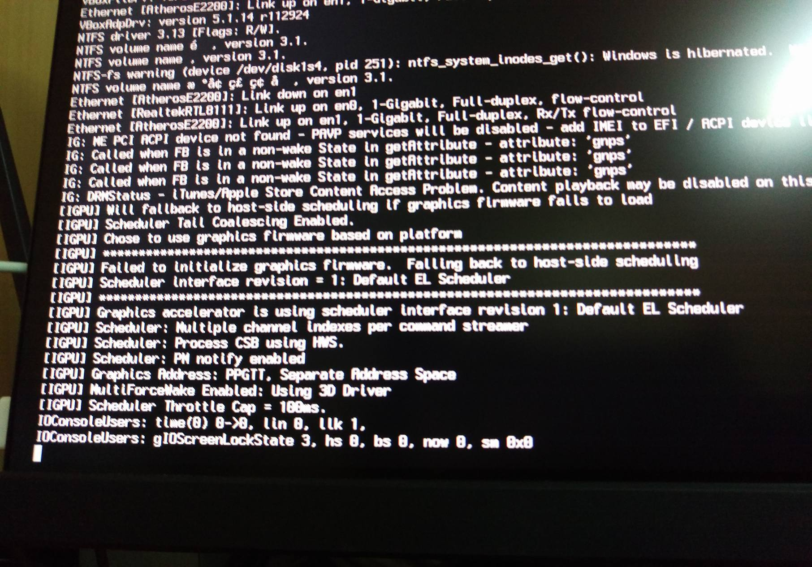
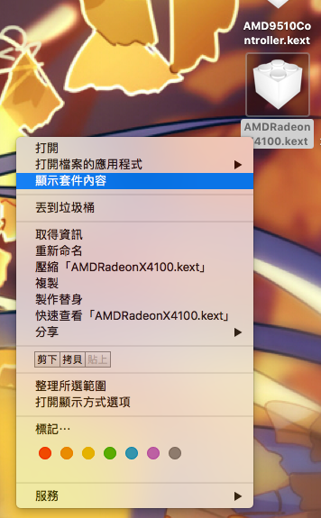

一不小心忘記關掉 app store 的自動更新了, 拖了兩個禮拜的通知更新, 終於忍不住給誘惑給它升上去了, 升級時沒遇到什麼大問題,不過果不其然地開機遇到了顯卡小雷 ( rx470 ) , 輸出接內顯就不會雷 但是接獨顯就雷了, 修改了 AMDRadeonX4100.kext 依然沒用, 當下只好先回舊版避避風頭

不過最近找到了問題所在, 原來是新多出來的 AMD9510Controller.kext 也要修改啊

### 修改方法

> 進入 /System/Library/Extensions/
> 
> 找到 AMD9510Controller.kext, AMDRadeonX4100.kext 複製出來

修改兩個 kext 的 Info.plist

各在 IOPCIMatch 底下添加 fake id ***0x67DF1002***

!\[螢幕快照 2017-04-11 下午11.25.59.png\](/content/images/2017/04/2017-04-11-下午11.25.59.png)

AMD9510Controller.kext/Content/Info.plist

!\[螢幕快照 2017-04-11 下午11.28.02.png\](/content/images/2017/04/2017-04-11-下午11.28.02-1.png)

AMDRadeonX4100.kext/Content/Info.plist

然後再用 KCPM Utility Pro 之類的軟體或手動覆蓋重新開機即可正常使用～

參考網頁：[連結](https://www.theitsage.com/install-radeon-rx-480-gpu-macos-sierra/)
