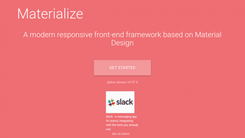
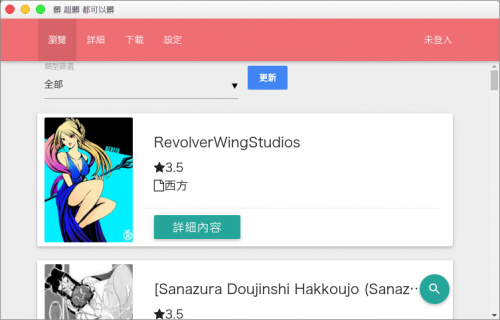
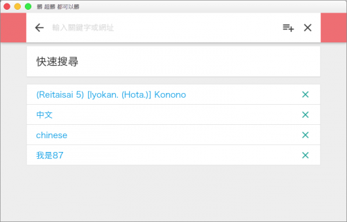

看到醜醜的[exhentai下載器](https://github.com/a9650615/hentai)，想來幫它換個新皮膚，想來個material design，但material ui感覺會太多於，於是使用了Materialize

它擁有了基本的material 設計元素，從表格，列表，Form元件皆有，其他像是loadingbar等等，還算不錯用

用法也很簡單，只須將css跟js引入即可

比較奇特的是，它還用了一個hammer js 功用未知

重點 wave 插件超好用

實做效果

