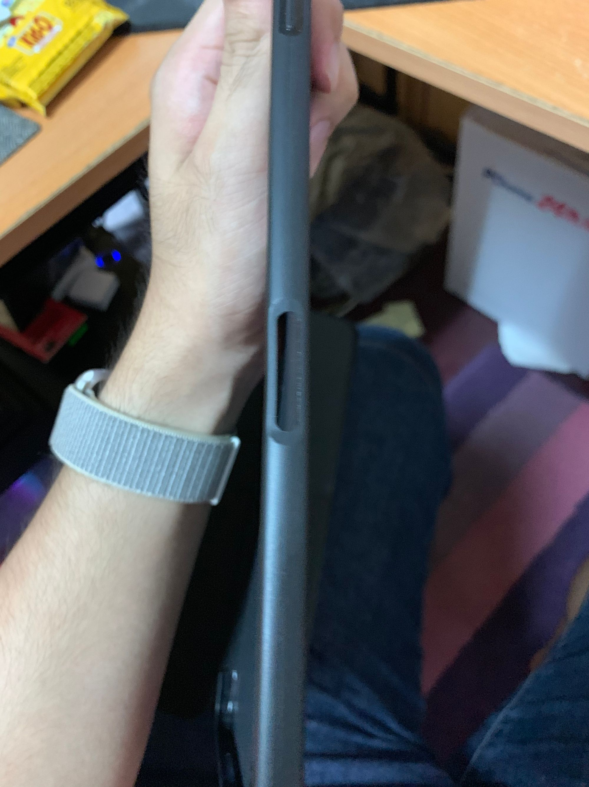
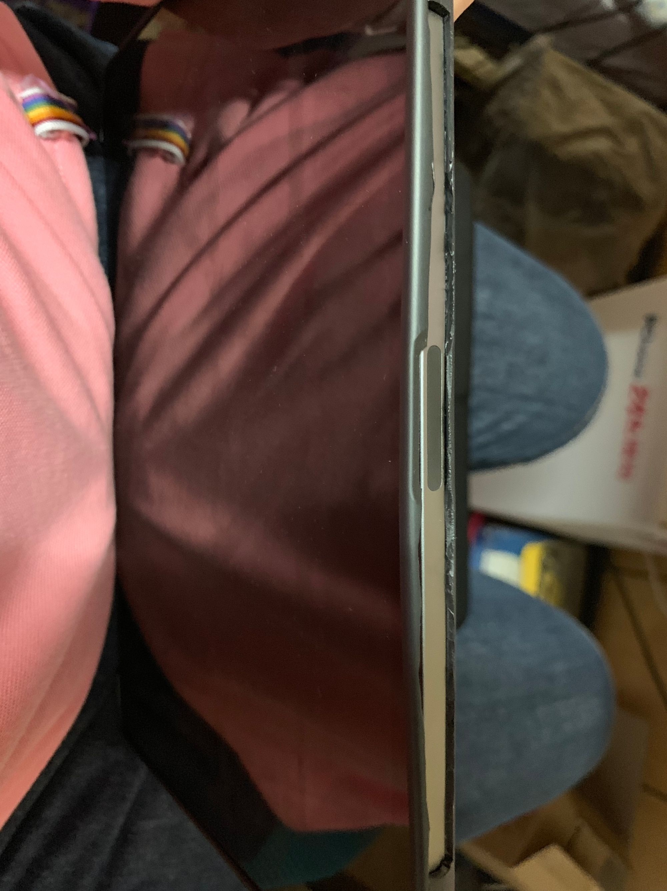
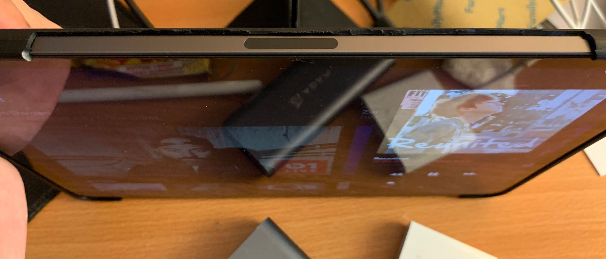
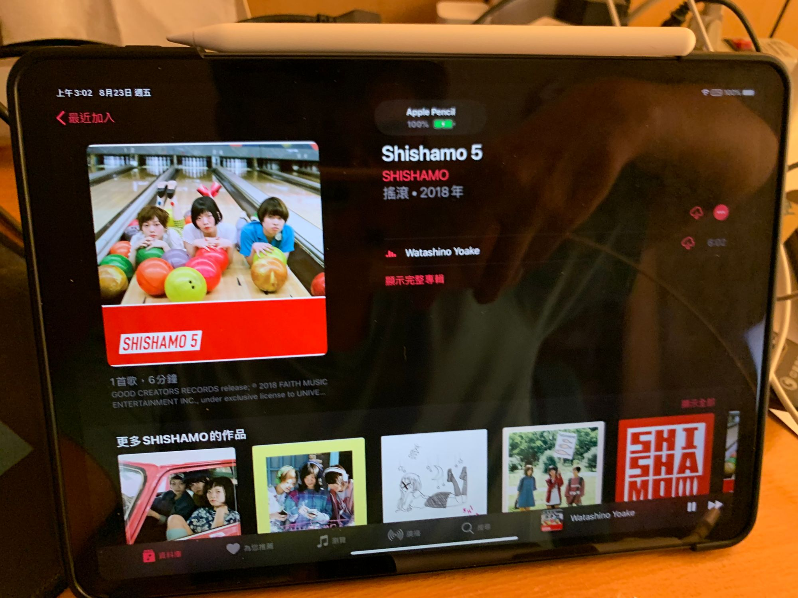

由於[舊站](https://bgpsekai.thisistap.com)實在太廢，害我只好狠下心租一台 vps 來放網誌了030

自從網站掛了之後一直沒有時間去還原，過了好一段時間之後才想到好久沒有更新網誌了，順便從肥肥的 wordpress 轉移到 Ghost 上，這又是另一個坑的開始，等不懶時再來說~

---

## 廢文開始

由於一時衝動買了 iPad Pro 11" ，隨便買了廉價殼後才發現筆的部分雖然可以吸上去，如圖

於是就異想天開的想如何清除障礙物，測完 Apple Pencil 2 吸的距離後發現大概厚度只能在一塊厚紙板以內，因此簡單丈量後就開始用剪刀沿原本開口開始剪開，雖然有點醜但是吸的到筆了www

但是剪完之後邊邊卻鬆了，一言不合就直接把邊邊全砍了，瞬間一整個完美(X)，最後就變成這樣啦

廢文也到此結束，期待以後可以繼續分享更多的東西 ( 廢文 ) 拉
