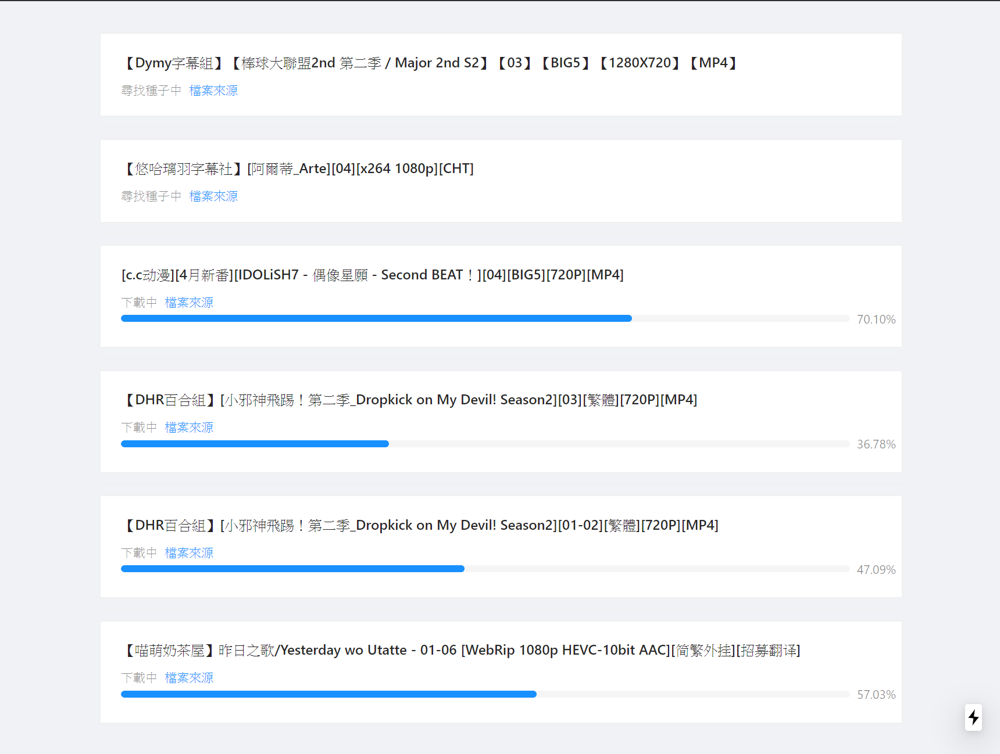

## 前言

這原本早在四年前就有想要做這樣的工具了，沒想到到當完兵之後才終於有動力可以把它完整的做出來了。在四年前其實只是個可以解析 DMHY 的工具，直到現在才整合了全部的功能。

而且意外的是效果也遠比自己預期的還要好很多XDD

## 專案位置

[下載端](https://github.com/a9650615/dmhy_newban_downloader)  
[WebUI](https://github.com/a9650615/dmhy_newban_downloader_webui)

## 原理

整體的原理其實不難，主要分為三部分

-   新番列表抓取
-   利用列表取抓取動畫
-   抓完動畫之後上傳到 Google Drive

列表抓取的部分是藉由 [https://acgsecrets.hk/](https://acgsecrets.hk/bangumi/)(希望大家也可以支持一下) 爬蟲去爬資料，為了不造成負擔是每三天才會更新一次。

之後第二步會到[動漫花園](http://share.dmhy.org/)去取得關鍵字，相關 BT 的資源等等，利用 web-torrent 去下載。

最後則是會將載完的資料依照動漫名分類傳到 Google Drive 上，完成後則會將檔案刪除。

雖然其實就這些東西，但也有不少技術難度，像是搜尋關鍵字查詢、字幕組的自動選擇、分析標題取得集數等等，完成度能到現在這樣我野蠻意外的(?)

## 專案結構

為了方便嘹解對應的功能及位置，

-   resource (放置資料的空間)
    -   NewBanDB.json 爬完後的新番列表都會在這
    -   TaskDB.json 排程下載的列表，載到第幾集及字幕組偏好設定等等
    -   GDDB.json 上傳到 Google Drive 的排程列表及相關設定等等
-   app (執行排程，初始化各功能)
-   lib (各功能模組)
    -   CronDmhy dmhy 爬蟲
    -   DownloadManger 下載管理器 (包含 webtorrent)
    -   NewBanCrawler 新番列表爬蟲
    -   TaskManager 管理下載列表
    -   UploadGD 上傳管理工具
-   db (資料管理，對應檔案都在 resource 資料夾)
    -   GoogleDriveDatabase GDDB 的相關操作
    -   NewBanDatabase NewBanDB 的相關操作
    -   TaskDatabase TaskDB 的相關操作
-   server.js 可以透過 http 取得下載狀態
-   webSocket.js 可以搭配 [webui](https://github.com/a9650615/dmhy_newban_downloader_webui) 取得及時下載進度

## F&Q

-   我需要什麼東西才能執行呢
    -   你需要先安裝 NodeJS 才能執行，至於執行方法已經寫在[專案](https://github.com/a9650615/dmhy_newban_downloader)上了
-   會提供一鍵執行的版本嗎
    -   等到哪一天有閒有錢的時候就會有了，不過確實是可以做到的(用 pkg 之類的工具)
-   如何轉移資料到其他裝置執行呢
    -   複製 resource 底下的所有 json 檔到你要的裝置的相同位置就可以囉
-   如何調整下載預設的字幕組
    -   如果要調整"下載前"的排序的話可以到 `config/subList.js` 調整你喜歡的字幕組順序，當然也可以添加更多，如果已經有下載過的請至 `TaskDB.json` 的 `banList` 內修改對應動漫的 `teamID`(teamID 對應動漫花園上的，可以自己查)

當然 有更多問題可以到下面留言哦~~~

## 目前已知問題 (但不影響使用)

-   完結的新番紀錄不會自己消失 (也就是說你的 NewBanDB / TaskDB / GDDB 內的動漫資訊紀錄會越來越多，不過不包含每一集的紀錄，也就是說是每過一季才需要擔心這問題 )，但是目前可以手動刪除，只是會有點麻煩。未來可能會加入一鍵刪除的功能，不過什麼時候就不好說，有人需要再來加吧~
-   WebUI 功能太少，目前只能看下載進度而已，而且新添加的檔案不會直接顯示，需要重整頁面才能看到

## 目前 WebUI 顯示效果

  
沒錯 就這樣而已
