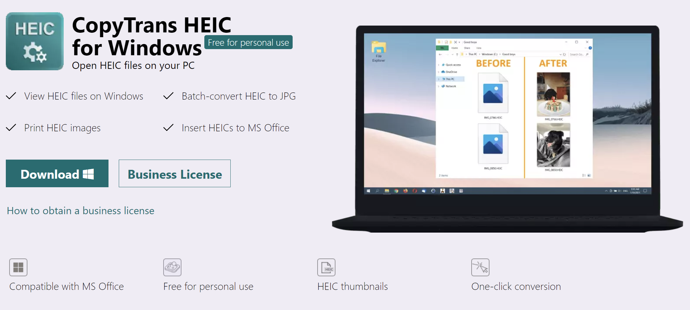
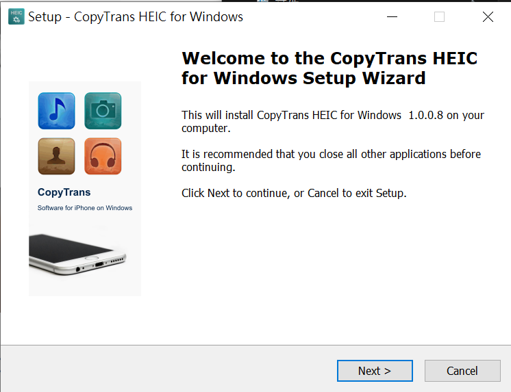
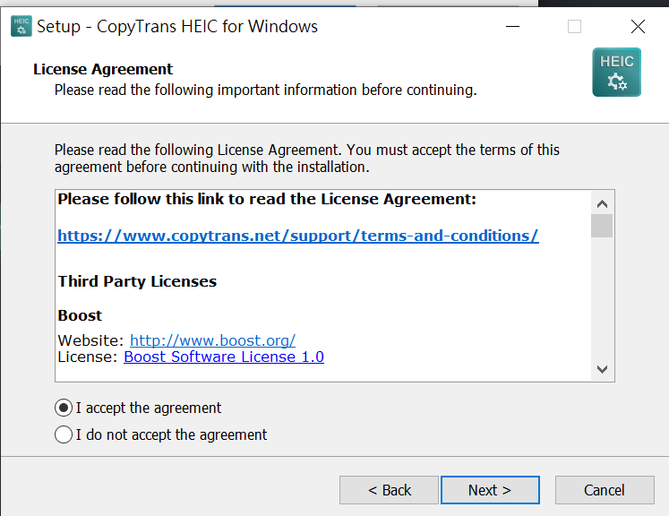
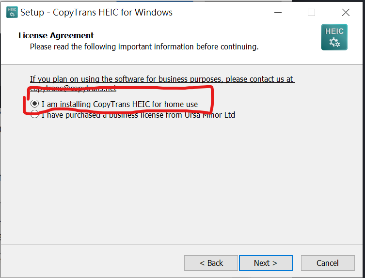
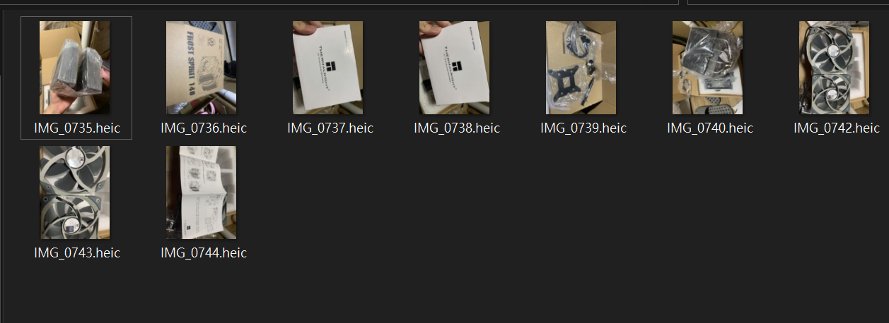
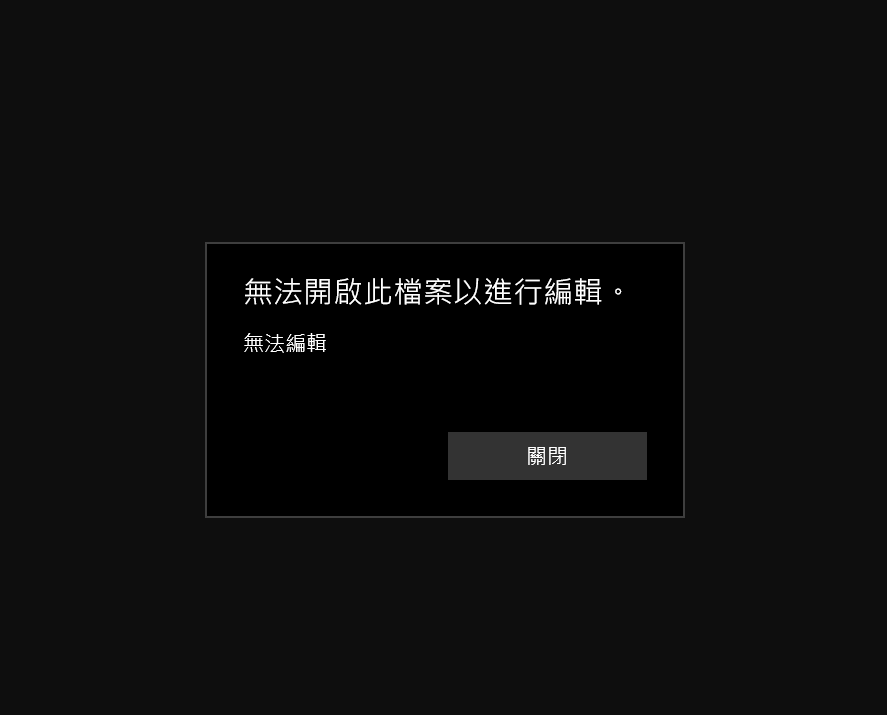
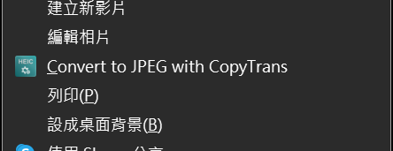

# 前言

眾所周知，蘋果非常喜愛自訂各種檔案格式來方便蘋果全家桶的便易性，或者是為了更好的壓縮比，然而對於非 Mac OS / iOS 系統而言根本就是災難，無法打開也無法編輯，更無法預覽，而這次要解決的問題是如何在 Windows 上開啟 iOS 常見的照片格式 HEIC 而不用安裝需要額外付費的官方插件，也就是 `copytransheic` 這個插件。

# 使用說明

首先，我們打開 [CopyTrans HEIC for Windows](https://www.copytrans.net/copytransheic/)，即可下載安裝，可以注意到的是個人使用是不需要收費的

接著下載並且安裝，安裝過程非常簡單，直直的 Next 下去就可以了

  

需特別注意的是第三部需要選擇家庭使用，否則需要付費  

接著安裝完成並且重啟後，你的電腦就可以預覽並且開啟 HEIC 格式的照片了，就這麼簡單!

當然，由於他只是個插件，沒有辦法利用系通內建的相片編輯器進行編輯，那該怎麼辦呢?

這就需要用到她的另外一個功能了: `轉換成 jpeg`

# 將照片轉換成 Jpeg

在想要的照片上按下右鍵，接著在選單中選擇以下選項

即可將照片轉換為 Jpeg 並且生成在同一個資料及內，非常簡單。多選也是可以的哦!
