原本的 rx460 玩各種最近的遊戲都只能開到中低實在是有點難過 加上最近 rx470 紅龍版的跳水加送遊戲 捏不住了 一不小心荷包又縮水了

總之 先上圖

[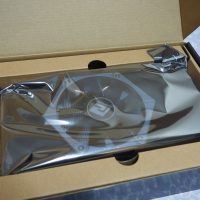](https://bgpsekai.thisistap.com/%e6%95%97%e5%ae%b6%e6%97%a5%e8%a8%98/2016/12/%e9%96%8b%e7%ae%b1-%e6%92%bc%e8%a8%8a-rx470-%e7%b4%85%e9%be%8d%e5%96%ae%e9%a2%a8%e6%89%87%e9%96%8b%e7%ae%b1%e5%8f%8a%e4%b8%8d%e5%b0%88%e6%a5%ad%e6%b8%ac%e8%a9%a6/attachment/olympus-digital-camera-5/)  
[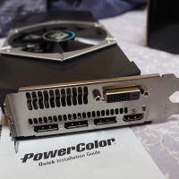](https://bgpsekai.thisistap.com/%e6%95%97%e5%ae%b6%e6%97%a5%e8%a8%98/2016/12/%e9%96%8b%e7%ae%b1-%e6%92%bc%e8%a8%8a-rx470-%e7%b4%85%e9%be%8d%e5%96%ae%e9%a2%a8%e6%89%87%e9%96%8b%e7%ae%b1%e5%8f%8a%e4%b8%8d%e5%b0%88%e6%a5%ad%e6%b8%ac%e8%a9%a6/attachment/olympus-digital-camera-4/) 包裝非常的簡單 跟小星星 rx460 比起來的話連金手指跟 port 保護殼都沒了 不過個人是還 ok

上機時真的是被我的小小機殼卡死 花了好一段時間終於塞進去了

(內部亂塞請當作沒看到

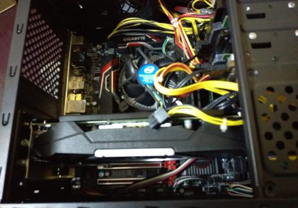

買大卡旁邊沒信仰看起來真不習慣 趕快封起來當作沒看到

上機前原本以為自己的 400w 銅牌會撐不住 沒想到上機操了一下也沒啥問題 虛驚一場

( 控制軟體就用以前沒有移掉的 AfterBurner 來測測吧 )

[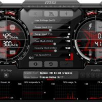](https://bgpsekai.thisistap.com/%e6%95%97%e5%ae%b6%e6%97%a5%e8%a8%98/2016/12/%e9%96%8b%e7%ae%b1-%e6%92%bc%e8%a8%8a-rx470-%e7%b4%85%e9%be%8d%e5%96%ae%e9%a2%a8%e6%89%87%e9%96%8b%e7%ae%b1%e5%8f%8a%e4%b8%8d%e5%b0%88%e6%a5%ad%e6%b8%ac%e8%a9%a6/attachment/15397773_1195258023899877_410092693_o/)[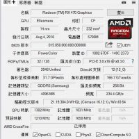](https://bgpsekai.thisistap.com/%e6%95%97%e5%ae%b6%e6%97%a5%e8%a8%98/2016/12/%e9%96%8b%e7%ae%b1-%e6%92%bc%e8%a8%8a-rx470-%e7%b4%85%e9%be%8d%e5%96%ae%e9%a2%a8%e6%89%87%e9%96%8b%e7%ae%b1%e5%8f%8a%e4%b8%8d%e5%b0%88%e6%a5%ad%e6%b8%ac%e8%a9%a6/attachment/15423625_1195284983897181_1834699540_n-2/)[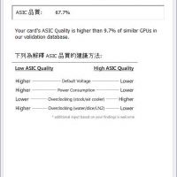](https://bgpsekai.thisistap.com/%e6%95%97%e5%ae%b6%e6%97%a5%e8%a8%98/2016/12/%e9%96%8b%e7%ae%b1-%e6%92%bc%e8%a8%8a-rx470-%e7%b4%85%e9%be%8d%e5%96%ae%e9%a2%a8%e6%89%87%e9%96%8b%e7%ae%b1%e5%8f%8a%e4%b8%8d%e5%b0%88%e6%a5%ad%e6%b8%ac%e8%a9%a6/attachment/15451101_1195294957229517_156875375_n-2/)基本上待機和原本的 rx460 差不多 差在 470 可以風扇不轉 待機溫度還可以接受

接下來 720p FM 測試一下

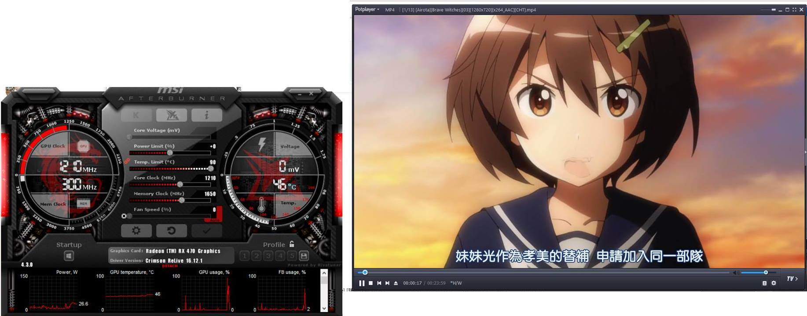

功號跟 460 幾乎一樣 溫度也只有少量提升

接下來換測遊戲吧 第一想到就 GTA5 就拿它吧

( 後來也有跑了 BF1 DX12 2K 中畫質目測因該也有接近 60fps 遊玩時壓電壓到 30mv 無明顯變化 溫度 6X 多

先來一般中等設定 ( FULL HD 視窗化 垂直同步開 細節懶得說明

[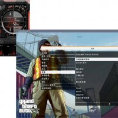](https://bgpsekai.thisistap.com/%e6%95%97%e5%ae%b6%e6%97%a5%e8%a8%98/2016/12/%e9%96%8b%e7%ae%b1-%e6%92%bc%e8%a8%8a-rx470-%e7%b4%85%e9%be%8d%e5%96%ae%e9%a2%a8%e6%89%87%e9%96%8b%e7%ae%b1%e5%8f%8a%e4%b8%8d%e5%b0%88%e6%a5%ad%e6%b8%ac%e8%a9%a6/attachment/15419242_1197740943651585_199527274_o/)[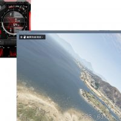](https://bgpsekai.thisistap.com/%e6%95%97%e5%ae%b6%e6%97%a5%e8%a8%98/2016/12/%e9%96%8b%e7%ae%b1-%e6%92%bc%e8%a8%8a-rx470-%e7%b4%85%e9%be%8d%e5%96%ae%e9%a2%a8%e6%89%87%e9%96%8b%e7%ae%b1%e5%8f%8a%e4%b8%8d%e5%b0%88%e6%a5%ad%e6%b8%ac%e8%a9%a6/attachment/15502960_1197742780318068_570206121_o/)想也知道輕輕鬆鬆 60附近擺動

接下來就要來玩玩壓電壓開全畫質可以挑戰到啥程度拉~

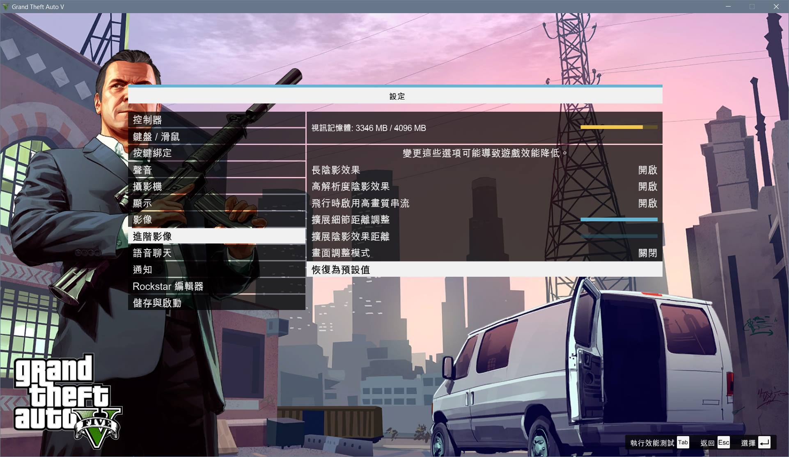

開好開滿 ( Full HD 視窗化 未開垂直同步 電壓降 30mv 超頻

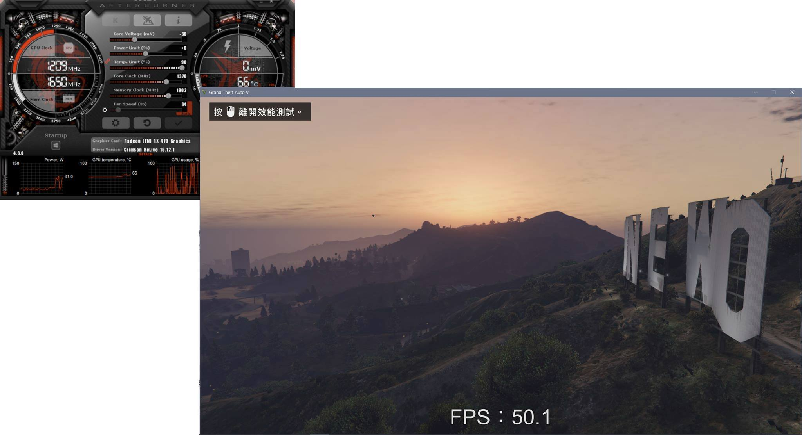

80w 附近到達 50~55fps ( 個人表示滿意

大概就這樣吧

附註 這風扇爆走 70% 以上時有點吵( 個人而言

91%以上後超吵 ( 最高轉速 3000 多

原廠硬體設置溫度到一定程度好像就會爆走了 只好手動軟體設定一下
