白色的PRO(以下簡稱白機)、黑色的PRO(以下簡稱黑機)

 黑機箱子 [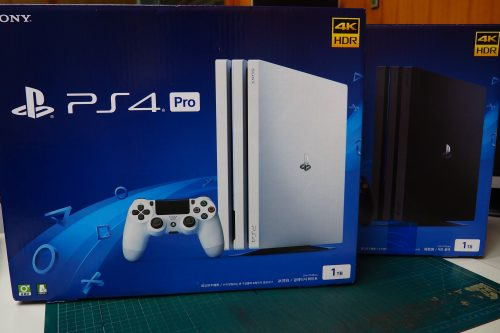](https://bgpsekai.thisistap.com/%e6%95%97%e5%ae%b6%e6%97%a5%e8%a8%98/2018/04/ps4-pro-%e5%a4%96%e8%a1%a8%e9%bb%91%e7%99%bd%e9%96%8b%e7%ae%b1/attachment/olympus-digital-camera-25/) 白機箱子  黑機前上  白機前上 …沒拍好 *(:3 」∠ )*

開始排排樂

[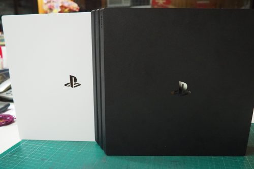](https://bgpsekai.thisistap.com/%e6%95%97%e5%ae%b6%e6%97%a5%e8%a8%98/2018/04/ps4-pro-%e5%a4%96%e8%a1%a8%e9%bb%91%e7%99%bd%e9%96%8b%e7%ae%b1/attachment/olympus-digital-camera-28/) 黑機正面 [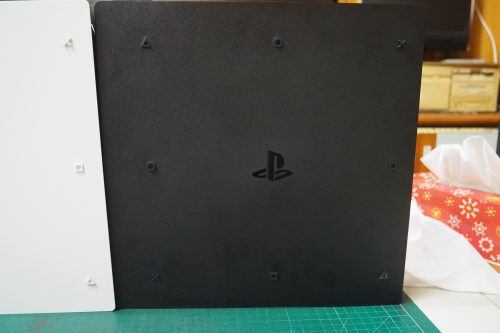](https://bgpsekai.thisistap.com/%e6%95%97%e5%ae%b6%e6%97%a5%e8%a8%98/2018/04/ps4-pro-%e5%a4%96%e8%a1%a8%e9%bb%91%e7%99%bd%e9%96%8b%e7%ae%b1/attachment/olympus-digital-camera-31/) 黑機背面 [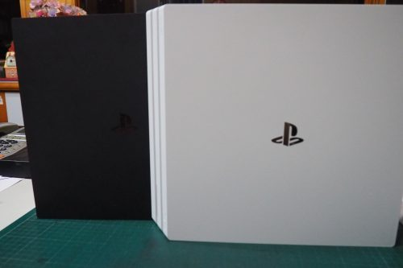](https://bgpsekai.thisistap.com/%e6%95%97%e5%ae%b6%e6%97%a5%e8%a8%98/2018/04/ps4-pro-%e5%a4%96%e8%a1%a8%e9%bb%91%e7%99%bd%e9%96%8b%e7%ae%b1/attachment/olympus-digital-camera-29/) 白機正面 [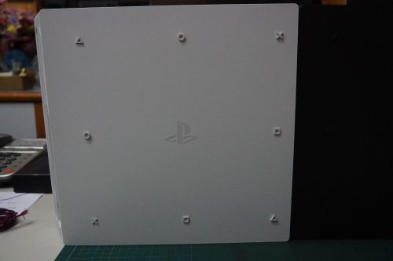](https://bgpsekai.thisistap.com/%e6%95%97%e5%ae%b6%e6%97%a5%e8%a8%98/2018/04/ps4-pro-%e5%a4%96%e8%a1%a8%e9%bb%91%e7%99%bd%e9%96%8b%e7%ae%b1/attachment/olympus-digital-camera-30/) 白機背面 疊起來成為6層超厚版

[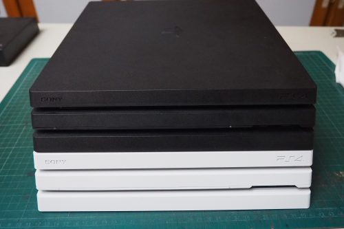](https://bgpsekai.thisistap.com/%e6%95%97%e5%ae%b6%e6%97%a5%e8%a8%98/2018/04/ps4-pro-%e5%a4%96%e8%a1%a8%e9%bb%91%e7%99%bd%e9%96%8b%e7%ae%b1/attachment/olympus-digital-camera-32/) 黑機上 [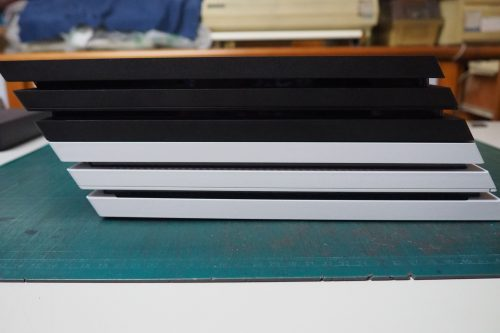](https://bgpsekai.thisistap.com/%e6%95%97%e5%ae%b6%e6%97%a5%e8%a8%98/2018/04/ps4-pro-%e5%a4%96%e8%a1%a8%e9%bb%91%e7%99%bd%e9%96%8b%e7%ae%b1/attachment/olympus-digital-camera-36/) 黑機左 [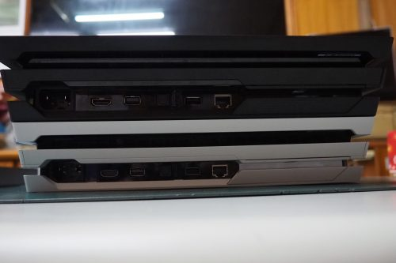](https://bgpsekai.thisistap.com/%e6%95%97%e5%ae%b6%e6%97%a5%e8%a8%98/2018/04/ps4-pro-%e5%a4%96%e8%a1%a8%e9%bb%91%e7%99%bd%e9%96%8b%e7%ae%b1/attachment/olympus-digital-camera-35/) 黑機下 [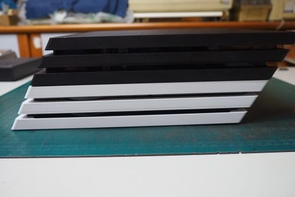](https://bgpsekai.thisistap.com/%e6%95%97%e5%ae%b6%e6%97%a5%e8%a8%98/2018/04/ps4-pro-%e5%a4%96%e8%a1%a8%e9%bb%91%e7%99%bd%e9%96%8b%e7%ae%b1/attachment/olympus-digital-camera-33/) 黑機右 [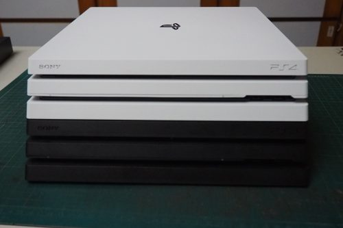](https://bgpsekai.thisistap.com/%e6%95%97%e5%ae%b6%e6%97%a5%e8%a8%98/2018/04/ps4-pro-%e5%a4%96%e8%a1%a8%e9%bb%91%e7%99%bd%e9%96%8b%e7%ae%b1/attachment/olympus-digital-camera-37/) 白機上 [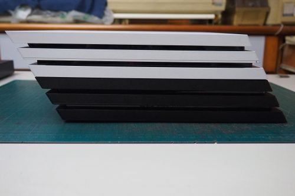](https://bgpsekai.thisistap.com/%e6%95%97%e5%ae%b6%e6%97%a5%e8%a8%98/2018/04/ps4-pro-%e5%a4%96%e8%a1%a8%e9%bb%91%e7%99%bd%e9%96%8b%e7%ae%b1/attachment/olympus-digital-camera-40/) 白機左 [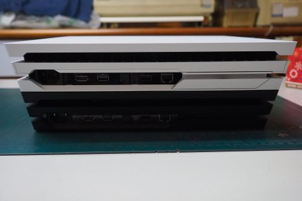](https://bgpsekai.thisistap.com/%e6%95%97%e5%ae%b6%e6%97%a5%e8%a8%98/2018/04/ps4-pro-%e5%a4%96%e8%a1%a8%e9%bb%91%e7%99%bd%e9%96%8b%e7%ae%b1/attachment/olympus-digital-camera-39/) 白機下 [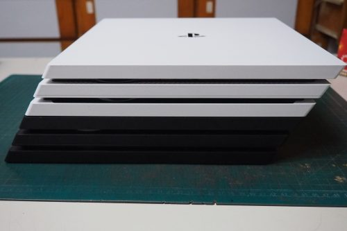](https://bgpsekai.thisistap.com/%e6%95%97%e5%ae%b6%e6%97%a5%e8%a8%98/2018/04/ps4-pro-%e5%a4%96%e8%a1%a8%e9%bb%91%e7%99%bd%e9%96%8b%e7%ae%b1/attachment/olympus-digital-camera-38/) 白機右 兩個顏色各有各好處

黑機摸了容易吃指紋但灰塵比較看不出來

白機模了不易吃指紋但灰塵就很明顯

人眼看起來黑不會那明顯吃指紋

而白機也沒有圖片中那麼白亮感

---

手把

[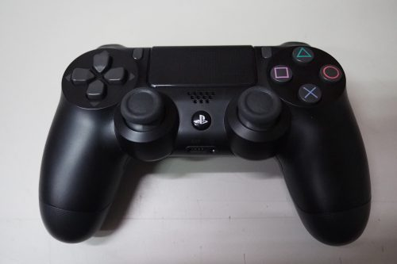](https://bgpsekai.thisistap.com/%e6%95%97%e5%ae%b6%e6%97%a5%e8%a8%98/2018/04/ps4-pro-%e5%a4%96%e8%a1%a8%e9%bb%91%e7%99%bd%e9%96%8b%e7%ae%b1/attachment/olympus-digital-camera-41/) 黑手把 [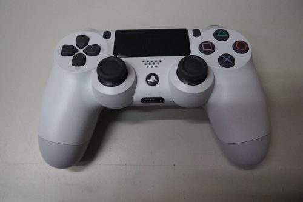](https://bgpsekai.thisistap.com/%e6%95%97%e5%ae%b6%e6%97%a5%e8%a8%98/2018/04/ps4-pro-%e5%a4%96%e8%a1%a8%e9%bb%91%e7%99%bd%e9%96%8b%e7%ae%b1/attachment/olympus-digital-camera-42/) 白手把 髓手亂拍

[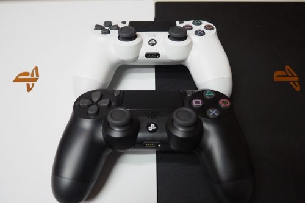](https://bgpsekai.thisistap.com/%e6%95%97%e5%ae%b6%e6%97%a5%e8%a8%98/2018/04/ps4-pro-%e5%a4%96%e8%a1%a8%e9%bb%91%e7%99%bd%e9%96%8b%e7%ae%b1/attachment/olympus-digital-camera-44/) 白與黑手把  黑與白手把 [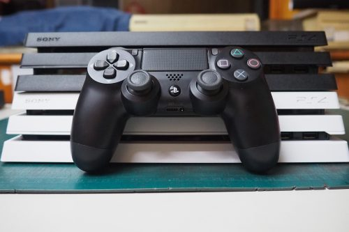](https://bgpsekai.thisistap.com/%e6%95%97%e5%ae%b6%e6%97%a5%e8%a8%98/2018/04/ps4-pro-%e5%a4%96%e8%a1%a8%e9%bb%91%e7%99%bd%e9%96%8b%e7%ae%b1/attachment/olympus-digital-camera-45/) 黑手把特寫 [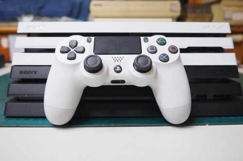](https://bgpsekai.thisistap.com/%e6%95%97%e5%ae%b6%e6%97%a5%e8%a8%98/2018/04/ps4-pro-%e5%a4%96%e8%a1%a8%e9%bb%91%e7%99%bd%e9%96%8b%e7%ae%b1/attachment/olympus-digital-camera-49/) 白手把特寫 關於製造日期

[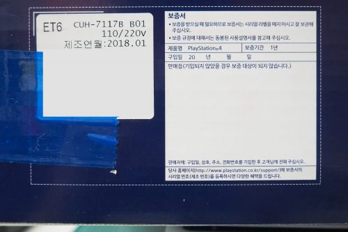](https://bgpsekai.thisistap.com/%e6%95%97%e5%ae%b6%e6%97%a5%e8%a8%98/2018/04/ps4-pro-%e5%a4%96%e8%a1%a8%e9%bb%91%e7%99%bd%e9%96%8b%e7%ae%b1/attachment/olympus-digital-camera-48/) 黑機出場日期2018.1 [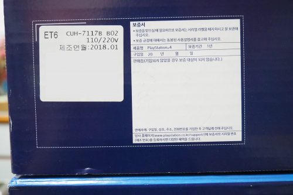](https://bgpsekai.thisistap.com/%e6%95%97%e5%ae%b6%e6%97%a5%e8%a8%98/2018/04/ps4-pro-%e5%a4%96%e8%a1%a8%e9%bb%91%e7%99%bd%e9%96%8b%e7%ae%b1/attachment/olympus-digital-camera-47/) 白機出場日期2018.1 購買到的日期

黑機是在2018.2.14、白機是在2018.3.29

至於購買到的地方是PlayStation的**其他經銷通路**

買到的，而不是特約門市

而都是原價12980元，而沒都綁片

黑機是那幾天都找剛好看到有說貨

趕緊打電話留貨留到的

白機是3月初就去預約

等了很久才終於拿到的

不過現在好像沒單機價格了

---

題外話

轉移功能還真是不錯用

網路線直連遊戲和資料都可以過去

17GB 五分鐘轉移完成，每秒複製70MB

等於是HDD的極限速度(還沒到網路線1Gbps)

兩台一起開MHW擺在一起玩

風扇聲音真的是超大聲的(有一點像電風扇音高一點)

兩台一起狂噴熱真的是超猛的

還沒買到了人也加油吧！

這次為什麼缺這麼久真的是很神奇！

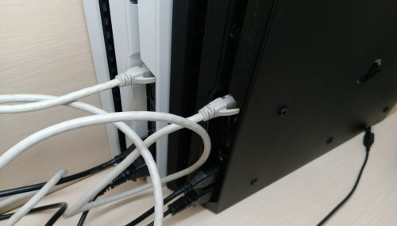

網路線直連圖

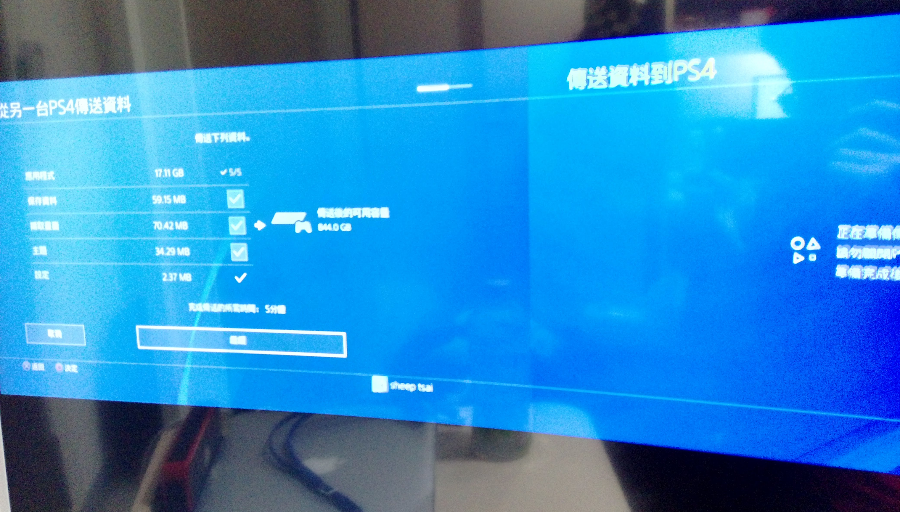17GB

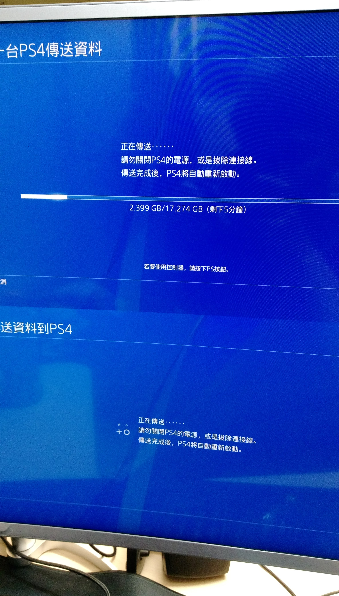

5分轉 移成功
