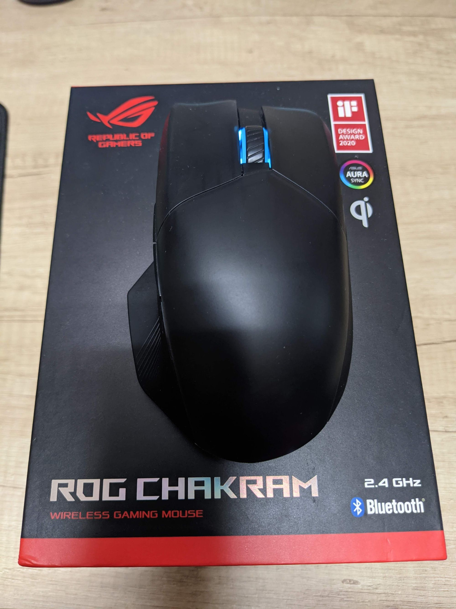
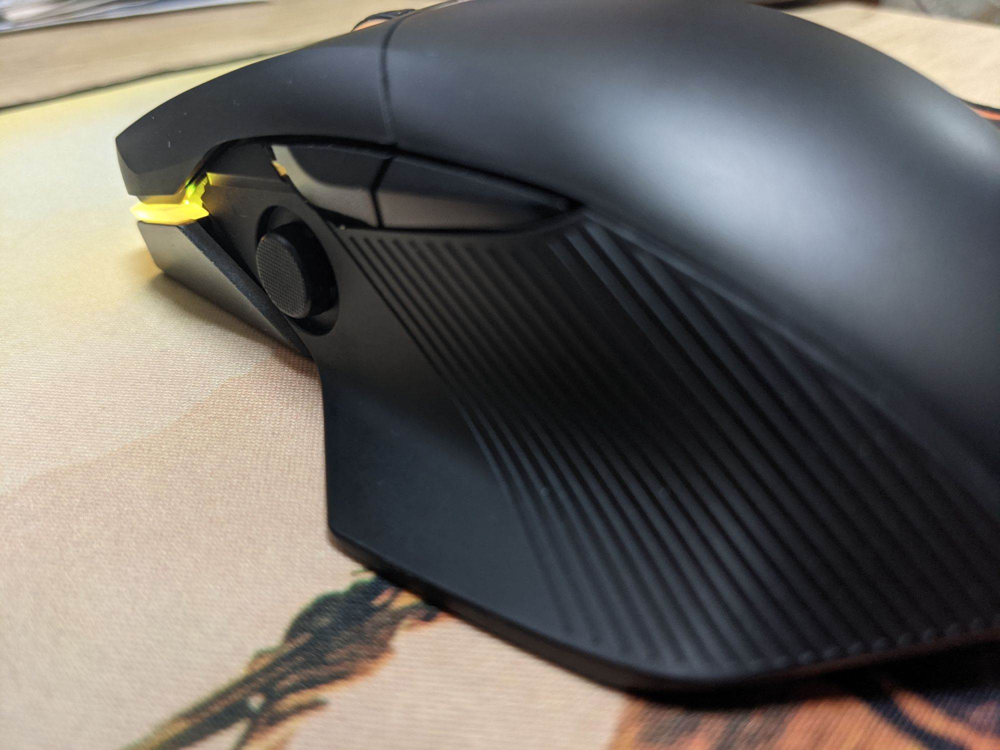
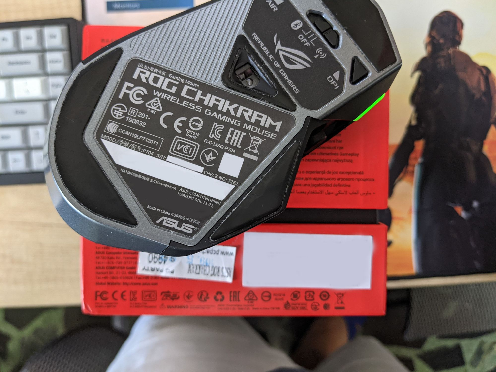

‌

開箱心得網路上有很多篇，內容物就不懶得貼了。

‌

主要就來講這隻滑鼠的體驗心得。

搖桿到達遊戲可以用但是不好用的的程度，盒子中長搖桿和短搖桿，但是長搖桿會造成搖桿滑鼠抓握干擾，所以就沒使用多就換短搖桿。

短搖桿就不太會抓握干擾，但是需要推的力量就回大幅增加，用來短時間點放是沒甚麼問題，但是如果用來遊戲長時間反彈力道就會過大，導致大拇指負擔還蠻重的。

還有搖桿本身沒有點擊功能也十分可惜，滑鼠會搖桿基本也是FPS飛機才會用到，但這滑鼠功能件很少，而搖桿好像是只有兩軸方向而已。

就是一個PSP搖桿的感覺...

‌  

DPI按鍵放在滑鼠底下，遊戲中無法直切切換DPI設定，換一個DPI需要拿起來滑鼠，加上滑鼠本身能自訂的按鍵基本上又不夠多(只有六個)，但扣掉搖桿只有兩個而已，軟體中DPI也只能輪迴而已，不能像羅技一樣上下皆換，DPI燈號顏色也不能客製化。

‌

左鍵和右鍵是整片可拆式，可以跟換被更換含滑鼠被蓋一樣式不錯，但被蓋的都不夠透光RGB效果不好，但是左鍵右鍵沒有框，還是希望滑鼠左右鍵有邊框可以放置更多的快捷鍵和比較不會誤壓到。

軟體用Armoury create跟主機板可以連動很方便，但是滑鼠的功能鍵沒有DPI上下切換，而且DPI設定常常自己切換到DPI3，而2.4G接收器不能和ROG鍵盤共用。

結論

優點  
\* 獨特的外型、前方顯目RGB  
\* 擁有2.4G、藍芽無線功能和有線  
\* 可以自定義按鍵  
\* 做工優良  
\* 特殊搖桿鍵  
\* 有軟體可以控制  
\* Type C 充電口

缺點  
\* 價格十分昂貴  
\* 不適合小手使用  
\* 滾輪無飛輪模式  
\* 不支援快充、快充會無法充電  
\* 軟體不夠優秀  
\* 錯誤的DPI切換按鍵  
\* 過於少自訂義按鍵  
\* 自家2.4G接收器無法共用  
\* armoury crate很爛會斷線連不上

看起來是理想遊戲解決方案，但很多體驗還可以改進，  
但付出的價格過多，不過只於昂貴的溢價。
