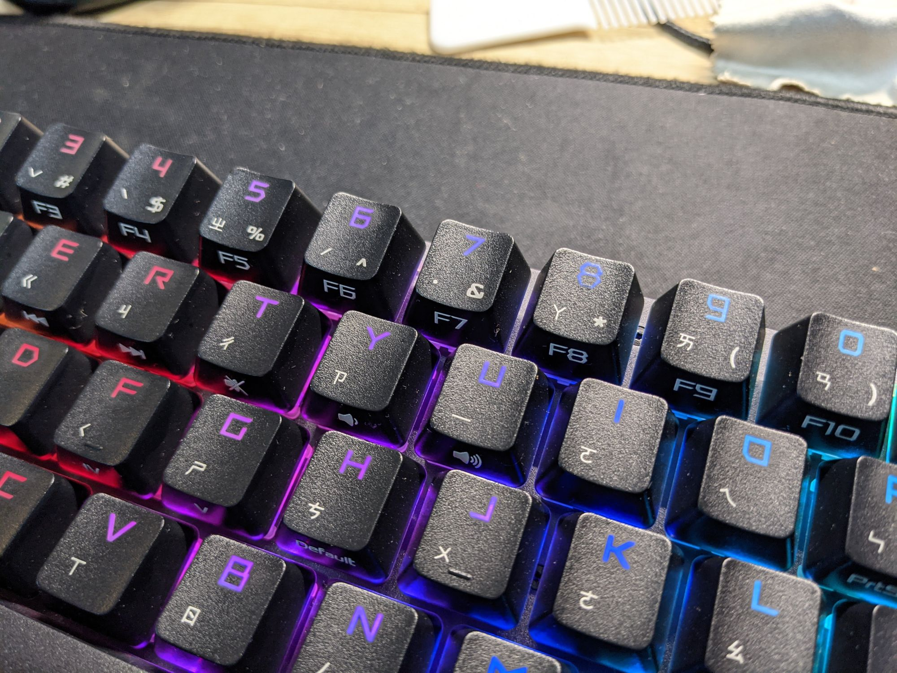
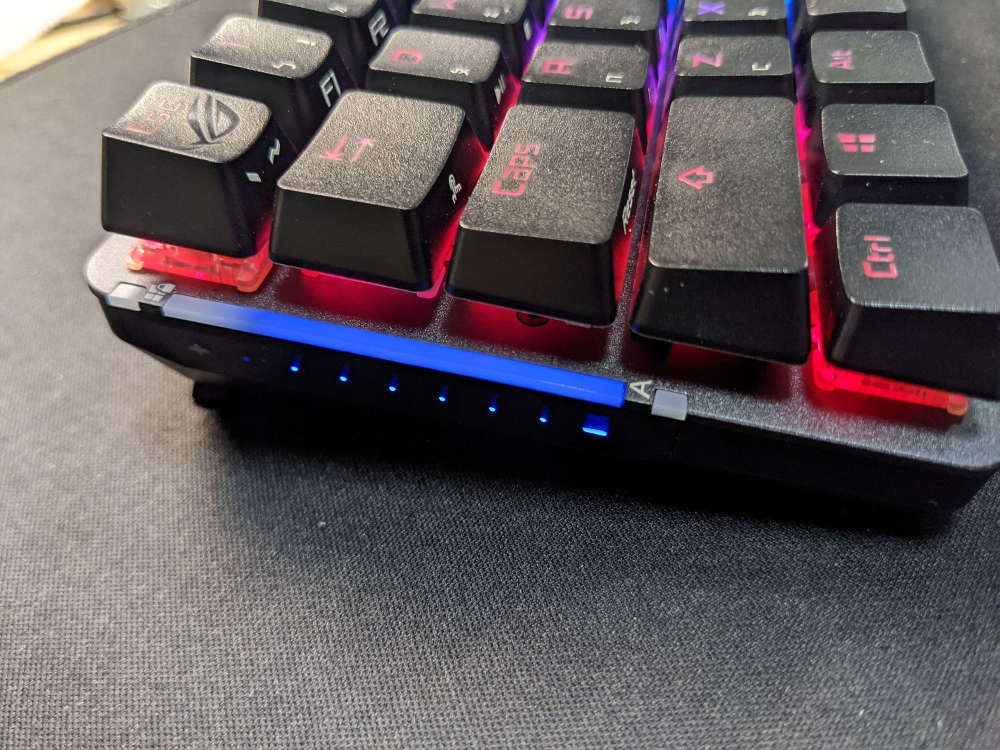

首先這把鍵盤在出廠的韌體版本有bug，無線喚醒的時候會調整到音量鍵，只要是2020年10月份的版本，都會有這個問題，用了armoury crate更新後就沒有這問題。

主要就來講這隻鍵盤的體驗心得。

鍵帽是霧面更一半鍵盤亮面的不太一樣PBT，而這紅軸回彈感覺曾經借過的Vortexgear Tab 75還要回彈速度還要快，可以是鍵帽的不一樣的關西吧，鍵帽就是一般標準的樣子，不像是Vortexgear Tab 75面積會偏小，但是鍵帽的字體真的是很醜，發光的亮度不是很均勻。

而互動式觸控觸控板只能說可以有無，感覺上放在右側會比較實際，左邊打遊戲放左邊Shift滑過去稍微誤觸到底部，或者抓起鍵盤還是很容易滑到，但至少軟體中可以感變滑動和點擊設定，可以關掉防止誤觸就沒啥了，平常可以拿來當調電量顯示燈看起來很高級或同步RGB。

軟體用Armoury create跟主機板可以連動很方便，但是鍵盤Armoury create讀取很慢，剛出廠韌體版本3～5秒還會失敗，更新後至少才不會瘋狂轉圈圈，而內建的fn組合鍵並沒有NuM number可以使用，可以能使用profile去設定切換設定檔才能使用，aura sync的設定也會因為待機而自動解除不會自行回復。

結論

優點  
\* 獨特的外型、有RGB  
\* 擁有2.4G、有線  
\* 可以自定義按鍵  
\* 軸體不會晃  
\* 有軟體可以控制  
\* Type C 充電口  
\* 快捷鍵有印在側面

缺點  
\* 價格偏貴  
\* 沒有藍芽  
\* 不支援快充、快充會無法充電  
\* 軟體不夠優秀、出廠版韌體有問題  
\* 過於少自訂義按鍵  
\* 自家2.4G接收器無法共用  
\* armoury crate很爛會斷線連不上

目前60% 2.4G少數的鍵盤，有特價可以接受，但是沒有藍芽是嚴重的缺點。
