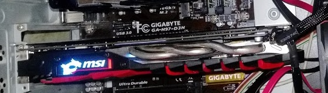
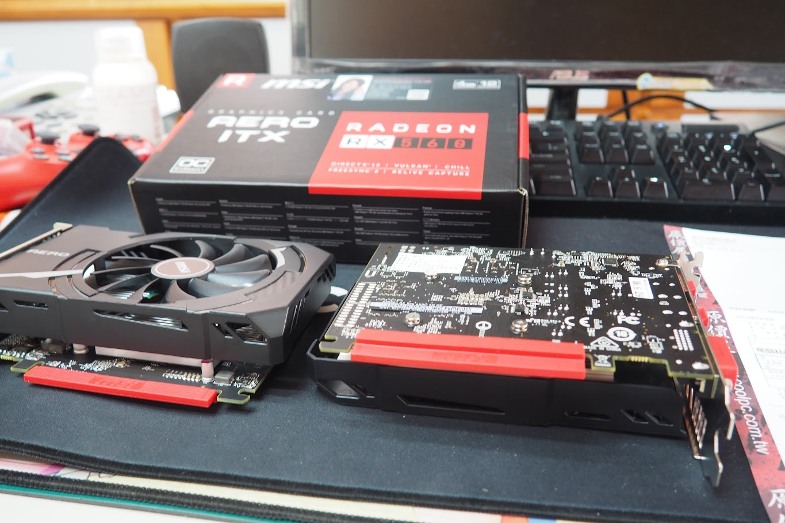
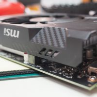
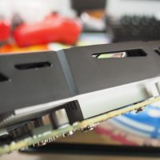
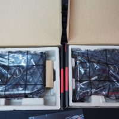
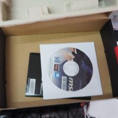
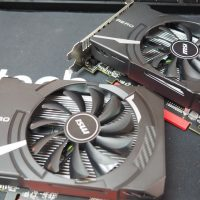

原本是想幫 RX 560 AERO ITX 4G OC開箱的，不過後來因為懶就沒開了，只能拿回憶來開箱。因為PTT不能上來開箱- - - - - -

當初原本有張RX488的但是遇上礦潮，下面這張 入手日期\[ 2016.9 – 2017.6 \]那時價格太好啦!一不小心就把它賣了但是以為可以很好還可以買到卡，錯了根本買不到跑了很多家店基本上都不賣或加價賣(就是不想買貴)原本曾經想上1070 O8G的，也有問到一家有(台中市區NOVA二樓*SNSV*)前二個小時還說可以用15490元賣，後來就不行要加價賣(一小時一千好賺…)- - - - - -

之後又繼續等，等這等著到處問到RX564可以單買只好又去漲價屋(彰化)就遇到了NPC，恩….害我跑了兩遍，第二次直接跳過NPC過一周後才看到後知後覺的公告，我到底看了什麼- - - - - -

就只好買兩張來壓壓驚 只是想試試看雙卡的威力(???  

先說結論答案: 474尾燈都看不到(遊戲上)  
 亂  拍  的 而原本以為有留一些效能數據的結果沒留… 囧- - - - - -

以回憶開箱，僅供參考Bios Max power limit 48W，耗電表現蠻好的基本上，雙挖來測試 (燒機神器)風扇 34%左右 1500轉左右 溫度 72C 超涼的但最高可以到4300轉? 吹風機?記憶體 超不上去 頂多+35mhz挖礦ETH :12Mh/s + DCR :330Mh/s 功耗54W上下(懶得壓)就真的是470的一半- - - - - -

遊戲方面(基準60fps 1080p)GTA5 中BF1 中BF1 4K 低 65%渲染尼爾 中吧(忘了)**CrossFire**後(印象模糊)GTA 5中高BF1中高尼爾 高(會掉FPS)- - - - - -

madVR + FM 不太行(印像模糊)NGU 因該只能low，一部分是記憶體頻寬不足題外話:GPU-Z ASIC質量73.8% 75.0% 可以贏90%??? 發生了啥事? (GF鍋?)- - - - - -

介護：以470一半來講效能真的是偏落，3K~4K可能要真的推NV(沒用過)，打一般線上遊戲因該是夠，單機遊戲因該不夠，我好懷念470 5K喔~能單卡就單卡，一加一不等於二，而人種是不會記起教訓

打開  

空虛配件

排排樂
