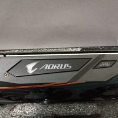
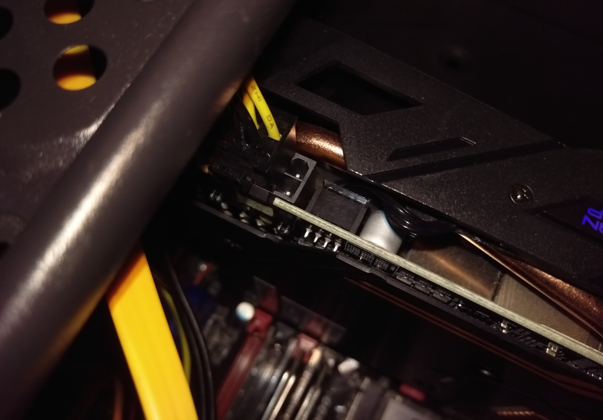
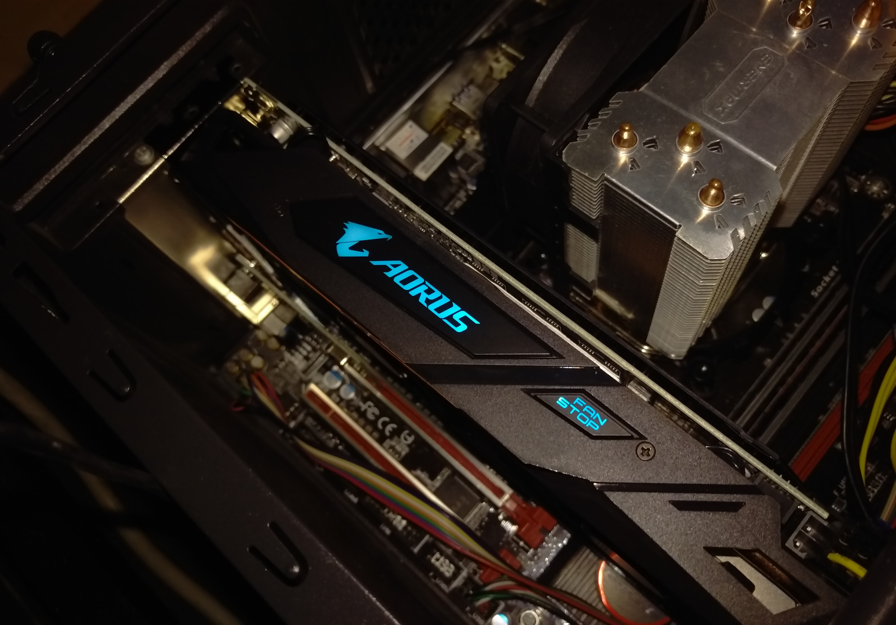
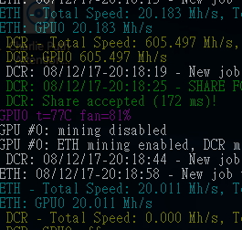
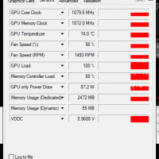
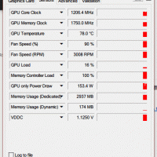
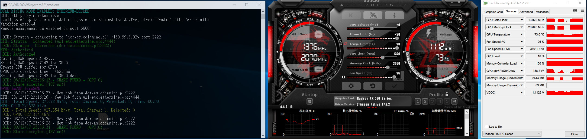
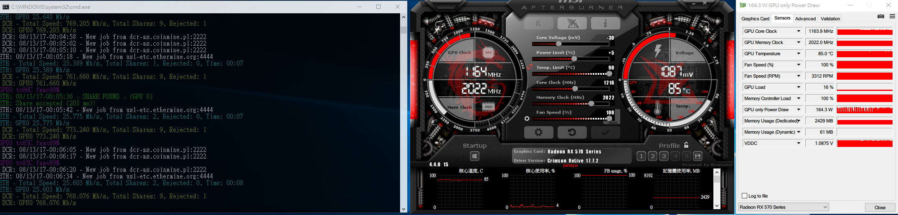

礦潮終於結束了，終於可以來開RX570 了，由於早就知道 RX 5 系列是 4 系列馬甲，晶片跟製成基本上都是一樣的，所以效能基本上就跟 rx 480 差不多吧，所以這裡就不測試效能了，總之先上開箱圖

<!-- removed: dead image https://blog.bgpsekai.club/content/images/2017/08/IMAG0069-200x200.jpg -->然而這張卡吃 8 pin，而我的 400w power 只有 6+6，原本以為接上去會爆，然而能用，警告燈也沒亮，那就繼續開箱吧

然後由於最近流行挖礦，所以也來展示一下挖礦的效能，首先以官方設定不超頻來挖礦

上面的是單挖 ETH 效能跟雙挖效能，整體來說就 一般般吧，接下來的是**重點**，先上圖

左邊這是 RX 470 挖礦時的狀況，右邊則是 RX 570 的，請注意功耗，其實 RX570 就是 RX480 吧，看得我頭好痛啊，所以在此奉勸，要挖礦還是去用 470 吧，5 系列什麼的，收益直接少一半，除非你電不用錢，要不然還是洗洗睡或降功耗吧

好，以上就是基本測試，接下來準備刷 bios 囉

刷完之後接著測試，基本上都有 24Mh/s ，接著超頻，根據個人測試，此卡極限單雙挖只能挖到 ETH: 27Mh/s, DCR: 800 Mh/s 附近，在怎麼超都超不到 28Mh/s ( 可能是我只給他吃6 pin 的關係，功耗上不去 ) ，重點是功號驚人

單挖功號到達 130w ，雙挖功號則到達 180w ( 插8pin 因該還可以更高 )，這跟 RX 480真的有得比，說好的 150w 呢?

最後附上個人最佳設定 ( 溫度請無視，機殼請選用會散熱的 )

後續新增: 挖礦時請壓功耗，然後記憶體其實拉太高也沒用 LOL
