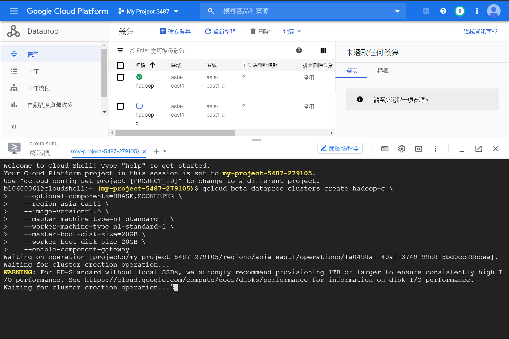
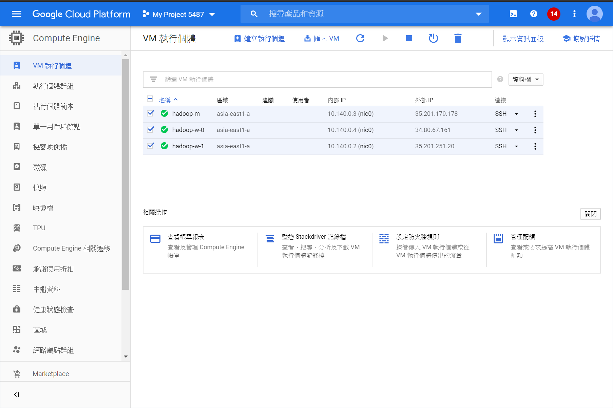

使用GCP的Cloud Shell來建立叢集



```
REGION=<region>
CLUSTER_NAME=<cluster_name>
gcloud dataproc clusters create ${CLUSTER_NAME} \
    --optional-components=HBASE,ZOOKEEPER \
    --region=[REGION] \
    --image-version=1.5 \
    --master-machine-type=n1-standard-1 \
    --worker-machine-type=n1-standard-1 \
    --master-boot-disk-size=20GB \
    --worker-boot-disk-size=20GB \
    --enable-component-gateway
```

加入HUE的版本 port:8888

```
gcloud beta dataproc clusters create hadoop \
    --optional-components=HBASE,ZOOKEEPER \
    --initialization-actions gs://goog-dataproc-initialization-actions-asia-east1/hue/hue.sh \
    --region=asia-east1 \
    --image-version=1.5 \
    --master-machine-type=n1-standard-1 \
    --worker-machine-type=n1-standard-1 \
    --master-boot-disk-size=20GB \
    --worker-boot-disk-size=20GB \
    --enable-component-gateway
       
```

但是HUE的設定不會用...

選擇hadoop-m開啟SSH  


```
hdfs dfsadmin -report
```

顯示hadoop的狀態

```
sudo jps
```

GCP要sudo jps才看到得狀態

參考資料:[https://github.com/GoogleCloudDataproc/initialization-actions/tree/master/hue](https://github.com/GoogleCloudDataproc/initialization-actions/tree/master/hue)
