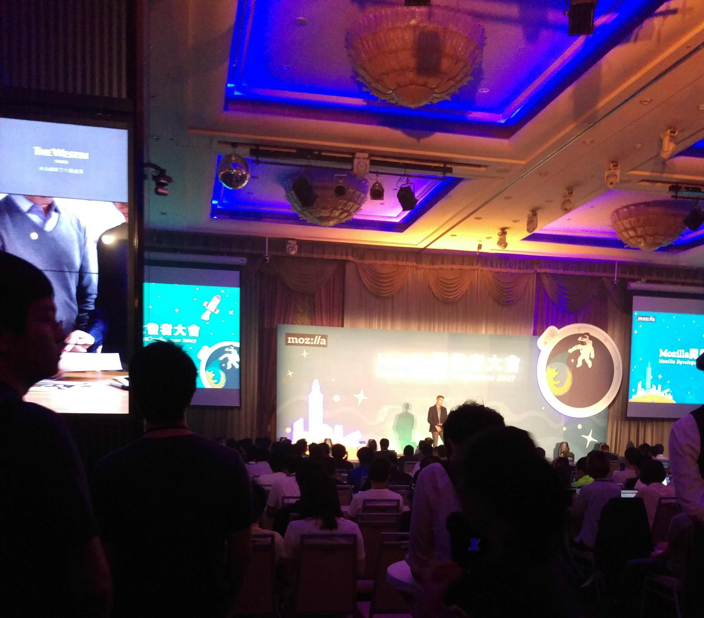
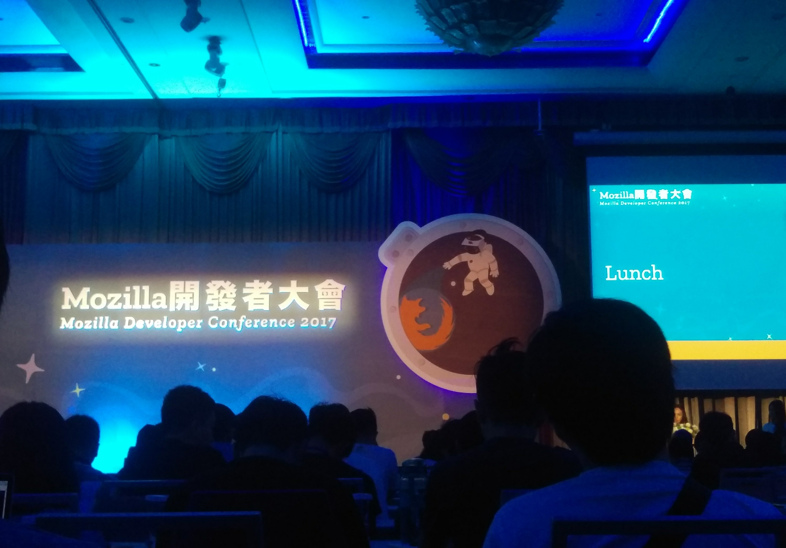
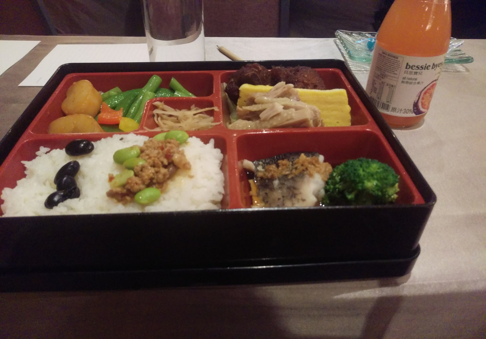
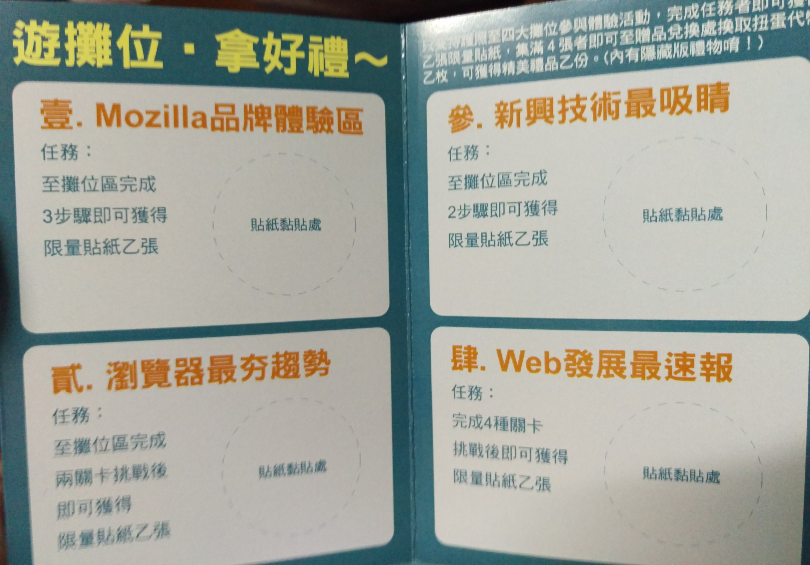
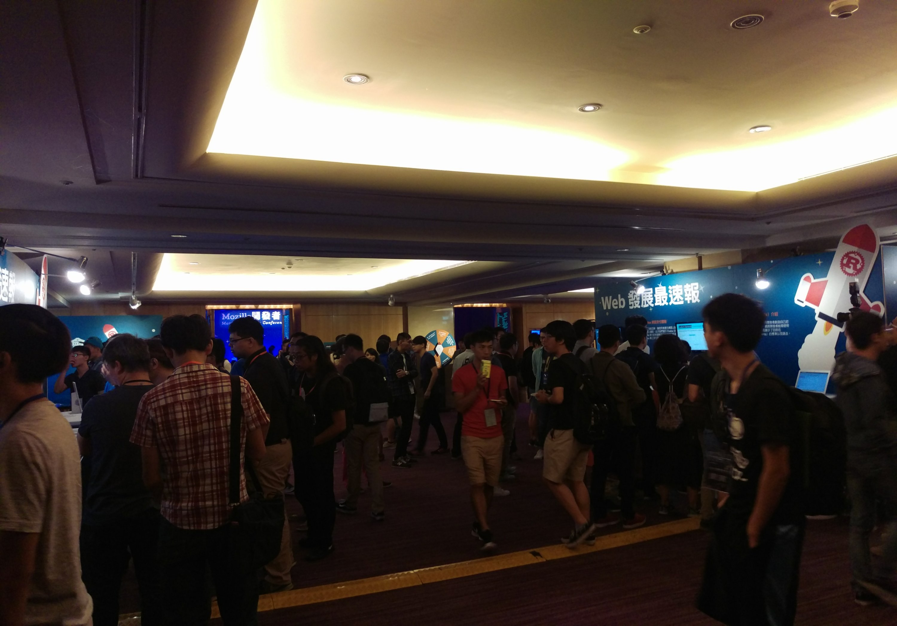
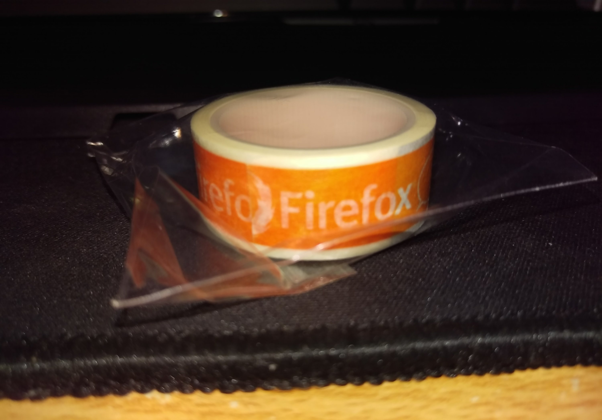
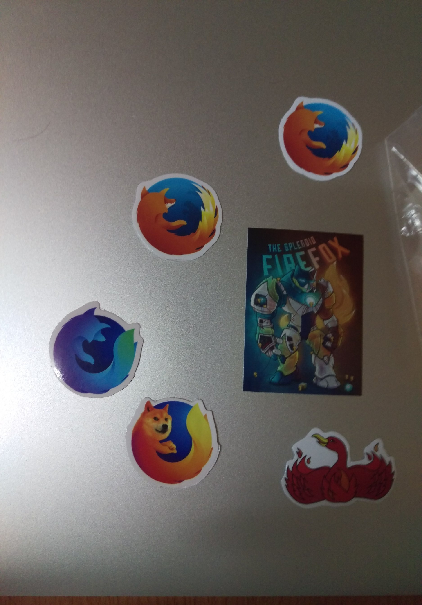
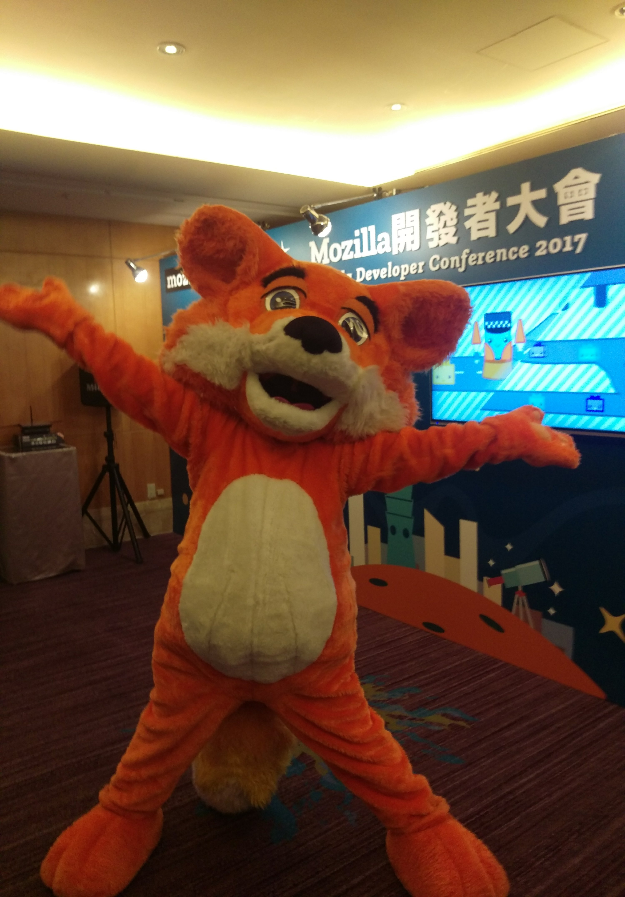
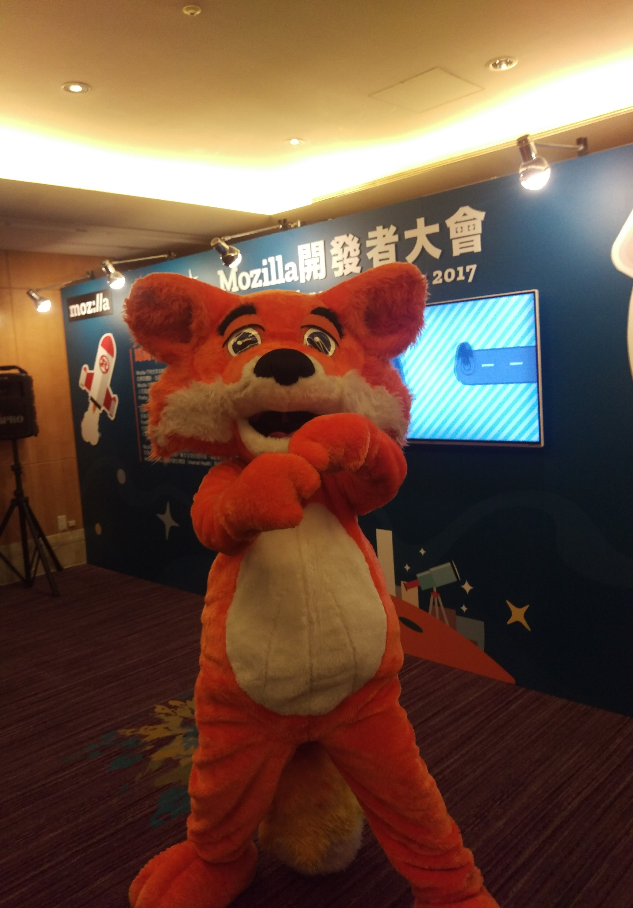
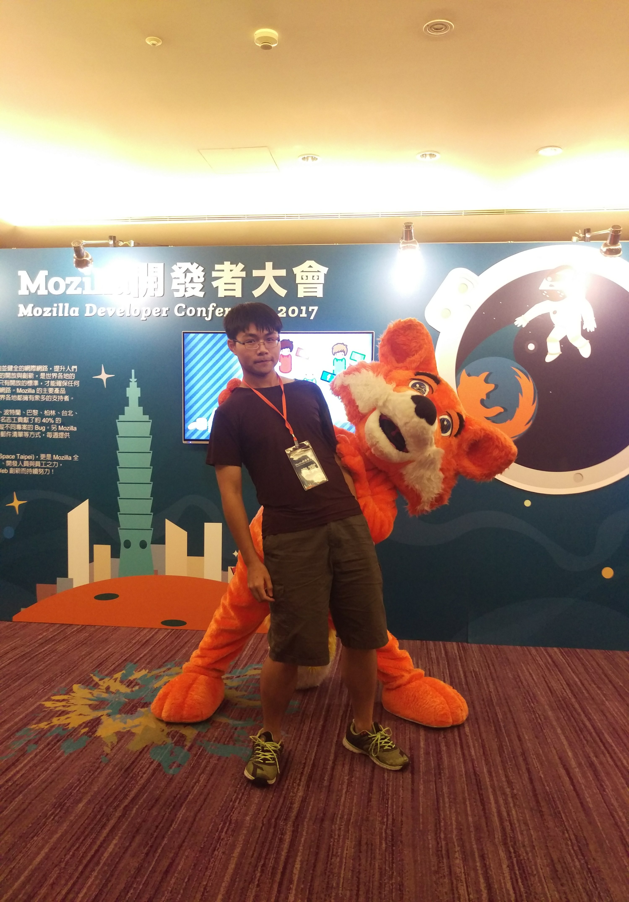

先給[官方網站](https://www.mozilladevtw2017.com/)

會去這趟大會完全是因為朋友問要不要去而去報名的 ( 掩面 )，原本以為是個很大的活動因該不會被通知，沒想到還真的是個不小的活動而且我還真的被通知了，然後就在不知道到重點在哪部分！

沒去過這種東西的死肥宅我進到會場實在有點嚇到，人實在真的有點多，這不是重點， by the way ，來講講內容好了，先說我是菜英文，只聽的懂大概。

上午的議程是有直播的，附上[傳送門](https://youtu.be/YZiUCMOa7_M)

還有[共筆](https://hackmd.io/EYRgZghsBsBMAMBaApsgHAVkQFgMwGMJEBOYAdmMX32IBMNrsJpkwg==) ( 我到寫這廢文時才看到有這玩意，真心 0 貢獻 ) ，因該比看我的說明還有用

### 開場 + 詳細說明

開場的部分是講解最早期 web 的發展，NetScape 的出現，然後 2004 年 Firefox 出現了，然後 IE 模仿了，然後 web 普遍起來了，然後 chromium 出來了，然後到了現在，Firefox 的 Quantum ( 好像中文叫量子計畫 ) 計畫發佈了，直接改了整個引擎，從多方向修正了 Firefox 的性能 ( 留下面講 ) ，還有新潮功能，像 VR 設備支援、開放語音分析Api ( Deep Speech )，好像還在實驗中，然後 UI 跟圖示改好改滿，一堆可愛動物，而且 Nightly 就可以用到了 666 ( 雖然對我這個用 chrome 的肥宅怎麼聽都像是安麗(x) )。

優化的部分則包含 CSS 多線程處理（但渲染父子順序沒有改變）、Photon 的渲染優化（將 HTML 解析後至 GPU 更新渲染）、Servo 引擎使用、ASM 支援、網路權重優化，JS 後端權重分配，還有很多細節我也不知道？

### 中午

然後就吃午餐拉 ( ? )，其實中間 Break 也有小點心，餅乾、蛋糕之類的（沒吃到有 cheese 的鹹麵包QQ），還不錯吃，也有咖啡跟紅茶可以喝，根本肥宅養成計畫。

至於便當的部分，還蠻高級的，量也頗多，賺 ( X )

### 午餐飯後

吃完之後該來運動一下了，在中央會廳有擺了四個區塊攤位，去參觀互動一下可以換貼紙，集滿四張可以去轉蛋換獎品，攤位的部分有 VR 跟 webGL 2 可以試玩、Extention 相關開發、Firefox 也實作付款 API Demo，Web RTC 影像應用，Firefox Nightly 跟 Firefox Focus 推廣。

然後在 Firefox Focus 不小心就被嘴到了，因為發現這瀏覽器就是個隱私瀏覽器，什麼複雜功能都沒有，要分享資訊需要開其他瀏覽器，我就嘴嘴的問為何不做個分享按鈕，在覺得可以分享個人資訊時按下那個按鈕就好了啊，然後講解人員講解了一陣子後說了一句『我們的專案都有開源，你也可以去上面貢獻一下XD』，然後我就只能 XD 的說句我盡量然後默默撤離，差點忘記我只是個廢物，只能提供意見沒資格嘴人

### 下午 (手機雷我 沒得拍)

有點懶了，大概講一下

下午的議程有分三區，我是選擇 C 議程的。

上半場的虛實整合說明了非常多種的方式去整合現有的資源提供資訊，硬體像是  QR code 、NFC、藍芽、音波、AR 等等，軟體 APP 或網頁 Url ，以及各種方式缺點以及整合，然後探討流程複雜度等等，算是個蠻有趣的探討。

上半場的另一個則是 WebVR，講解了最早的發展等等，然後推廣了自家開發的 A-frame，以及很 short cut 流的 Live Code 講解了跟 three.js 的應用，讓我感受到了現場 wifi 被人擠滿後 webVR 的素材載入優化是很重要的 ( ?

---

下半場我偷跑去 A 議程，聽了一個很難懂得 Binary AST，從解譯、轉譯等等講出 JS 的優化極限有限，不如直接跑組語 ( JSBin ) 跳過 Compile，可是有檔案可能變更大問題，不如編成 Binary ，然後就是 webassembly 的部分了，還有現有速度雖然快超多，但是並沒有優化，請自己優化，總之我覺得我不行，難度頗高但是覺得是未來必需品。

最後則是 Http2 ，用蠻好懂得方式說明了 HTTP 的 Ping Pong 模型與 TCP 的問題 ( 頭小身體大 )，早期解決方案用一堆 connection ，然後一堆問題，學了一下計概，然後說明了 HTTP2 的多線程功能，變成只需要1個 connection，很重要！然後還有 HTTP2 的權重讀取、取消功能，不用像 HTTP 取消需要斷開魂結，AND HTTP2 搭配快取 + TCP 原理 Combo 加成，猛，最後小講了一下可能是未來規範的 QUIC ，是 HTTP2 + UDP 的實作的樣子，不再受限於 TCP 限制，希望會很猛。

最後附上戰利品  
 總之算是一次蠻有趣的經驗，雖然完全沒有膽量跟能力去問問題，不過這次參觀真的了解到了不少的東西和社群的力量啊～

啊還有活潑吉祥物

