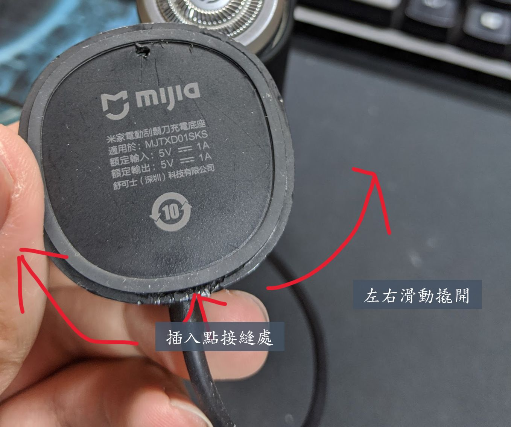
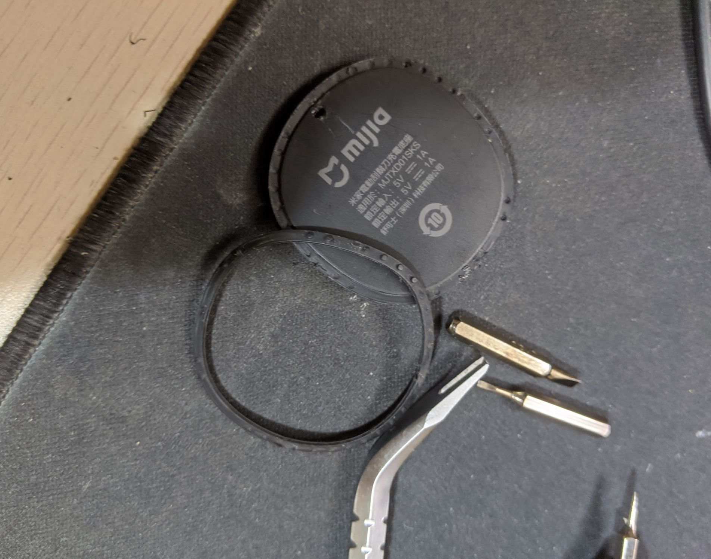
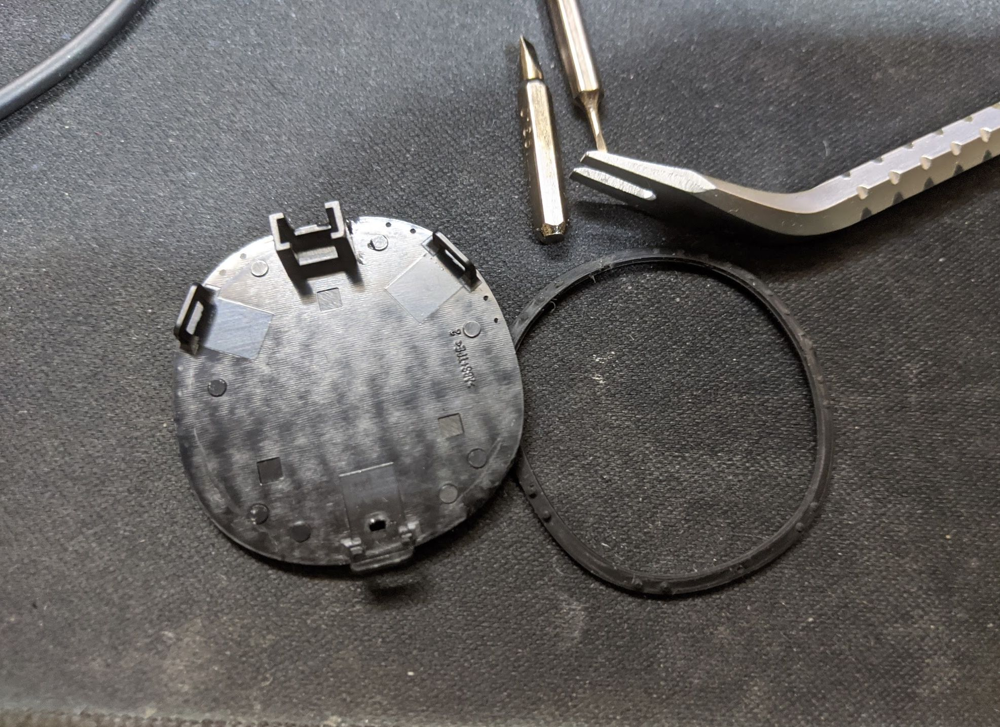
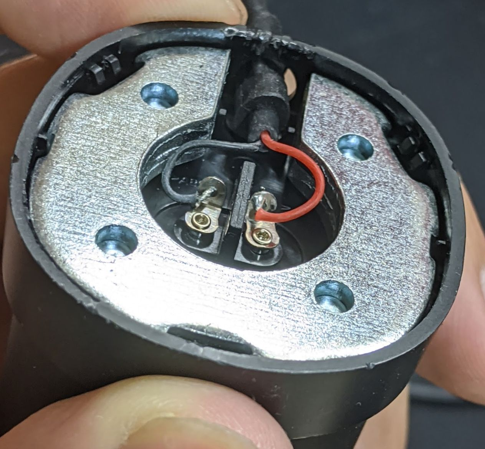
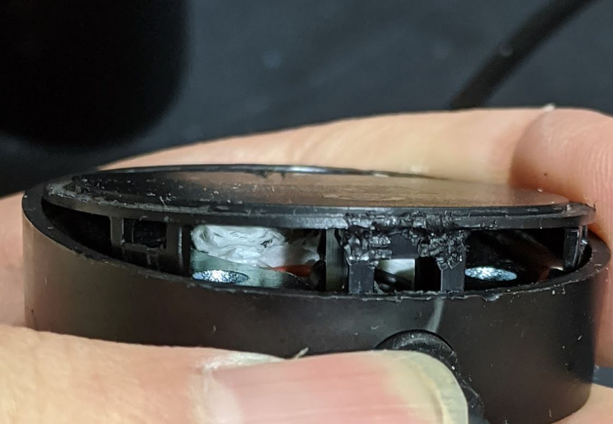

小米台灣有上米家電動刮鬍刀那隻充電底座時常衝不到電，所以就把它拆了。

首先要先拔到橡膠條不過拔就裝不太回去了，插入充電線後方的縫，往左右撬開。  

撬開的蓋子的樣子。  
  

內部的樣子，由於充電只有兩接點彈片的接觸，導這很大的機會會壓過頭而無法接觸。  

所以解決的方法就是在下方塞法填充物讓金屬接點可以相互碰到。(塞衛生紙)

也就這樣理論上因該就可以解決無法充電的問題了，不過底座會稍微爛掉。

如果還是這樣用過無法充電的話，請用力擦一擦底座接觸點，  
或在底座上轉一轉。
